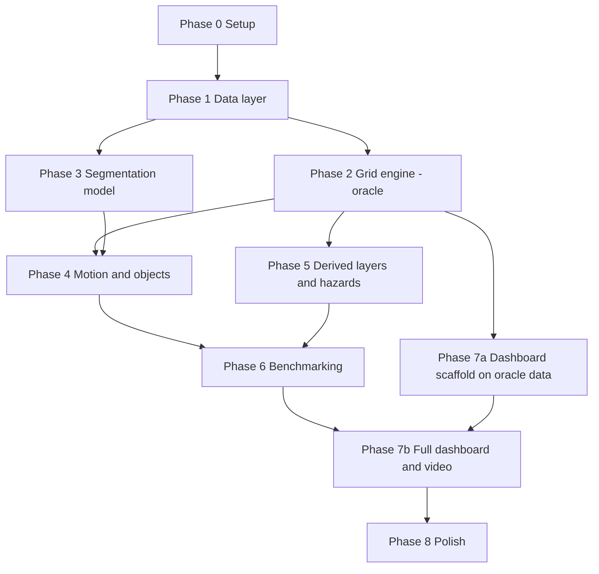

# FoveaMap — Adaptive Variable-Resolution 2.5D LiDAR Mapping

**Smart India Hackathon 2026 · Problem Statement SIH26053**
**Title:** Adaptive Variable Resolution 2.5D Lidar Mapping for Dynamic Environment Perception

> **Foveated 2.5D LiDAR mapping: sharp where a mistake hurts, cheap where it doesn't.**
> A deep-learning pipeline that turns raw LiDAR point clouds into a foveated, variable-resolution 2.5D elevation-and-semantics map, inspired by how human vision keeps the centre of gaze sharp and the periphery coarse.

**Document status:** this README is the **single source of truth and the full implementation plan** for the project. It is written to be executed by a human team *or* an autonomous coding agent (e.g. Claude Code). Read Section 0 before doing anything else.

---

## Table of Contents

0. [How to Use This Document (Agent Operating Contract)](#0-how-to-use-this-document-agent-operating-contract)
1. [Problem Statement](#1-problem-statement)
2. [Our Idea — FoveaMap](#2-our-idea--foveamap)
3. [Locked Decisions & Assumptions](#3-locked-decisions--assumptions)
4. [Quickstart & Installation](#4-quickstart--installation)
5. [Data Specification](#5-data-specification)
6. [Technical Design](#6-technical-design)
7. [Repository Structure](#7-repository-structure)
8. [Configuration Reference](#8-configuration-reference)
9. [Module Interface Specifications](#9-module-interface-specifications)
10. [Phased Implementation Plan](#10-phased-implementation-plan)
11. [Testing Strategy](#11-testing-strategy)
12. [Evaluation & Benchmark Specification](#12-evaluation--benchmark-specification)
13. [Dashboard & Demo Specification](#13-dashboard--demo-specification)
14. [Risk Register](#14-risk-register)
15. [Honest Limitations](#15-honest-limitations)
16. [Roadmap (Future Work)](#16-roadmap-future-work)
17. [Why This Solution Answers the Problem Statement](#17-why-this-solution-answers-the-problem-statement)
18. [Acknowledgements & Licensing](#18-acknowledgements--licensing)
- [Appendix A — SemanticKITTI Label Map](#appendix-a--semantickitti-label-map)
- [Appendix B — Master Definition of Done](#appendix-b--master-definition-of-done)
- [Appendix C — Agent Prompt Templates](#appendix-c--agent-prompt-templates)
- [Appendix D — Makefile Targets](#appendix-d--makefile-targets)
- [Appendix E — Glossary](#appendix-e--glossary)

---

## 0. How to Use This Document (Agent Operating Contract)

This section is binding for any agent or engineer working in this repository.

### 0.1 Precedence and reading order

1. Read this README **completely** before writing any code.
2. If two sections disagree, precedence is: **Section 3 (Locked Decisions) > Section 10 (Phase tasks) > Sections 6, 8, 9 (specs) > everything else.** Log every conflict you find in `docs/DECISIONS.md`.
3. The work is divided into **Phases 0–8** (Section 10). Every phase has tasks (`T<phase>.<n>`), deliverables, and a **gate** (an executable acceptance check). **Do not start Phase N+1 until Gate N passes**, except for the parallel tracks explicitly allowed in Section 10.0.

### 0.2 Operating rules

| # | Rule |
|---|------|
| R1 | **Never hard-code a result number** (memory reduction, accuracy, latency, cell counts) in code, docs or dashboards. Every number is computed from configs or benchmark output. Result tables in this README live between `<!-- BEGIN:RESULTS -->` and `<!-- END:RESULTS -->` and are regenerated by `make report`. |
| R2 | **Never weaken a test, threshold or gate to make it pass.** If a test is genuinely wrong, fix it in a separate commit and log a deviation (R6). |
| R3 | **Config over constants.** No magic numbers in code. Every threshold, radius, cell size and path comes from `configs/*.yaml` (Section 8). |
| R4 | **Determinism.** Seed every RNG (`seed: 1337` default in configs). Same inputs must yield bit-identical grid output on the same backend. |
| R5 | **Honest reporting.** Report negative results. Never call the system "real-time" unless the measured end-to-end p95 latency is below the sensor period (Section 6.10). Always show sample sizes next to far-range numbers. |
| R6 | **Deviation log.** Any departure from this plan is appended to `docs/DECISIONS.md` as one line: `D-### · YYYY-MM-DD · Phase · what changed · why · impact`. |
| R7 | **Time-boxes and fallbacks.** Every uncertain step has a time-box and a fallback in Section 10. When a time-box expires, take the fallback, log a deviation, and move on. No single blocker may stall the project. |
| R8 | **Commit discipline.** One task = one commit, message format `<type>(<module>): T<phase>.<n> <summary>`. When a gate passes, tag `phase-<N>-complete`. Never commit `data/`, model weights, or `results/cache/`. |
| R9 | **Human-in-the-loop steps are marked `[HUMAN]`.** Stop and ask the user for those (dataset registration, GPU access, credentials). Do everything else autonomously. |
| R10 | **Progress tracking.** After each task, tick the checkbox in Section 10 and append a line to `docs/PROGRESS.md` (date, task id, commit hash, one-line outcome). |
| R11 | **Environment first.** Run `make doctor` at the start of every session. It verifies Python, CUDA, compilers, Node, data layout and weights, and prints exactly what is missing. |
| R12 | **Oracle-first.** Build and validate the grid engine against ground-truth labels before any model is wired in, so grid error and model error are never conflated. |
| R13 | **Cache, don't recompute.** Model inference runs once; predictions are cached to disk. All downstream stages must run from the cache with no GPU. |
| R14 | **Ask only when blocked.** Inside the bounds of Section 3, decide autonomously and log the decision. |

### 0.3 Priority tiers (cut line if time runs out)

| Tier | Contents | Cut policy |
|------|----------|------------|
| **P0 — Minimum Winning Demo** | Phases 0, 1, 2 (oracle grid + invariants + memory), Phase 3 (model + accuracy by distance), Phase 7 core panels (map, fovea overlay, memory meter, latency, accuracy-vs-distance), offline video | Never cut |
| **P1 — Strong differentiators** | Phase 4 (motion + objects), Phase 5 (kerb/slope/clearance/traversability), Phase 6 (full benchmark suite), fovea slider, zoom lens | Cut only after P0 is green |
| **P2 — Nice to have** | Synthetic hazard injection UI, C++ accelerated backend, distance-weighted fine-tuning, extra presets, quantisation experiments | Cut first |

### 0.4 Parallel tracks (for multi-agent or multi-person work)



Phase 2 and Phase 3 are independent after Phase 1 and can run in parallel. The dashboard scaffold (7a) may begin as soon as the WebSocket message schema (Section 13.3) is frozen at the end of Phase 2.

---

## 1. Problem Statement

**Background.** Autonomous vehicles need to perceive their surroundings with high precision. Raw 3D LiDAR point clouds are information-rich but expensive to process in real time; plain 2D occupancy grids are cheap but throw away the height information needed to detect curbs, potholes, or overhanging obstacles. The problem calls for a **foveated mapping approach**, like human vision, where the area immediately around the vehicle is rendered in high detail for safety, while distant regions are simplified to save compute and memory.

**What must be built.** A system that:

1. **Terrain Analysis** — separates drivable surfaces from non-drivable terrain.
2. **Object Detection** — classifies static obstacles (walls, poles, buildings) and dynamic objects (pedestrians, vehicles), including their motion state.
3. **Adaptive Spatial Representation** — a non-uniform grid whose cell size grows with distance from the sensor, implemented without alignment errors or data loss when projecting 3D points into 2.5D.

**Expected solution components** (as specified in the PS):

| Component | Requirement |
| --- | --- |
| Deep learning model | Semantic segmentation of point clouds into terrain / static obstacles / moving objects (e.g. PointNet++ or a Sparse CNN) |
| Variable-resolution grid engine | Projects classified 3D points into a 2.5D grid: fine cells (e.g. 5 cm) within 10 m, coarsening (e.g. 50 cm) out to 100 m |
| Real-time visualization | Dashboard with colour-coded terrain/objects and a demonstrated memory-usage reduction vs. a uniform high-resolution 3D map |
| Performance metrics | Low latency / high FPS and classification accuracy reported across distance |

---

## 2. Our Idea — FoveaMap

FoveaMap converts every LiDAR scan into a **foveated 2.5D map**: a set of nested, precisely-aligned grids whose cell size grows outward from the sensor (5 cm → 10 cm → 20 cm → 40 cm). Every cell stores ground height, obstacle height, overhang clearance, a semantic class, a "moving" flag, and a confidence score.

**Central insight — the fovea matches the sensor, not just the budget.** A rotating LiDAR's point spacing is a few centimetres at 10 m but tens of centimetres by 100 m. Fine cells far away are mostly empty; the ring sizes are chosen from this physical sampling limit, not picked arbitrarily, and we prove that with a density-vs-range plot.

### 2.1 Pipeline at a glance

```
Raw LiDAR scans + poses + calibration
        │
        ▼
Data layer  ──  pose alignment, ground-truth/label handling, range bucketing
        │
        ├───────────────────────────────┐
        ▼                                ▼
Semantic Segmentation Model         Oracle mode (ground-truth labels)
(pretrained range-view network)     — isolates grid error from model error
        │  per-point class + confidence
        ▼
Motion Estimation  ──  scan-to-scan residual + cluster voting → moving/static + object boxes
        │
        ▼
Foveated Grid Engine  ──  nested rings, square, alignment-verified
        │  layers: ground height, top height, overhang clearance, class, motion, count, confidence
        ▼
Derived Layers  ──  slope, kerb/step detection, clearance, traversability
        │
        ▼
Benchmarking (memory · latency · accuracy-by-range)  +  Real-Time Dashboard
```

### 2.2 What makes this approach credible

1. **Oracle-first, modular build.** The grid engine and dashboard are built and validated against ground-truth labels first, so a working demo exists before the deep-learning model is even wired in. This also separates "error caused by grid coarsening" from "error caused by the model", a distinction most naive solutions never make.
2. **Predictions are cached, not recomputed live.** Model inference runs once on GPU; the grid engine, evaluation, and dashboard then run on any laptop from cached predictions.
3. **A modern, real-time-capable segmentation network**, chosen on measured accuracy/latency evidence rather than defaulting to PointNet++, which does not scale to full scans in real time. This choice is justified quantitatively (Section 6.3).
4. **A trade-off explorer** directly answers the hidden question behind the problem statement: *does coarsening the far field actually hurt accuracy or safety?* We sweep grid presets and report memory-vs-accuracy honestly, whichever way it comes out.
5. **An iso-memory baseline.** A uniform 20 cm grid over the same area uses roughly the same number of cells as the foveated grid. Comparing the two answers the sharpest version of the question: *at equal memory, does foveation buy accuracy?*

### 2.3 What the live demo shows

- **Fovea overlay** — ring boundaries drawn on the map with their cell sizes labelled.
- **Memory meter** — live comparison of dense 3D, sparse 3D, uniform 2.5D, and FoveaMap memory footprints.
- **Latency/FPS bar** against the sensor's real-time budget.
- **Accuracy-vs-distance curve** — uniform grid vs. foveated grid, per range bucket.
- **Fovea slider** — drag ring radii/cell sizes and watch the map, memory, and accuracy update live.
- **Zoom lens** — the same kerb rendered at fine and coarse resolution, showing exactly why the fovea sits near the vehicle.
- **Object boxes** with class labels; moving objects are visually distinguished.
- **Synthetic hazard injection** — a pothole/kerb/overhang is inserted on demand to show which ring detects it.

---

## 3. Locked Decisions & Assumptions

These decisions are **final**. Change them only through a logged deviation (R6).

| ID | Decision | Rationale |
|----|----------|-----------|
| **L1** | **Dataset:** SemanticKITTI (KITTI Odometry velodyne + SemanticKITTI labels). Sequences **00–10** only (11–21 have no public labels). | Only public LiDAR set with per-point labels, poses, and moving-object classes that matches the class list and pretrained checkpoints. |
| **L2** | **Splits:** *dev/tuning* = sequences **04 and 07**; *final reporting* = sequence **08** (the standard validation sequence; pretrained checkpoints did not train on it). **Never tune thresholds on 08.** | Prevents leakage into reported numbers. |
| **L3** | **Sensor assumptions:** KITTI Velodyne HDL-64E, **10 Hz**, so the real-time budget is **100 ms per scan**. Vehicle frame = Velodyne frame (x forward, y left, z up, metres). | Defines "real-time" (R5). |
| **L4** | **Grid extent:** ±100 m square around the sensor, i.e. the half-open square `[-100, 100) × [-100, 100)` m, so a 200 m × 200 m area. Points outside are counted, never silently lost (Section 6.5.6). | Matches the PS (out to 100 m). |
| **L5** | **Default preset `fovea_default`:** rings 0–10 m @ 5 cm, 10–30 m @ 10 cm, 30–60 m @ 20 cm, 60–100 m @ 40 cm. **Alternate `ps_literal`:** 0–10 m @ 5 cm, 10–100 m @ 50 cm. **Baselines:** `uniform_5cm` (fine), `uniform_20cm` (**iso-memory** baseline). Optional: `uniform_40cm`. | Sensor-matched design, PS-literal design, and fair baselines. |
| **L6** | **Coordinate quantisation:** all grid arithmetic is done on **integer millimetres** (`int32`/`int64`), with floor-division for cell indices. No floating-point division on the boundary path. | Eliminates boundary/rounding ambiguity (e.g. `0.15/0.05 = 2.9999…` in floating point). |
| **L7** | **Ring rule:** a point belongs to the smallest ring `k` with `-R_k ≤ x < R_k` **and** `-R_k ≤ y < R_k` (half-open, signed). All `R_k` and all ring cell sizes are integer multiples of the finest cell size, and `R_{k-1}` is a multiple of `s_k`. | Exact partition of the plane: no gaps, no overlaps, no double counting. |
| **L8** | **Grid engine implementation:** a pure **NumPy reference backend** (the correctness oracle) plus an **optional C++/pybind11 accelerated backend** that must match the reference **bit-for-bit** on all accumulators. The pipeline auto-falls back to NumPy if the C++ module is not built. C++ is required only if the NumPy grid stage exceeds its latency budget (Section 6.10). | Honours the C++ proposal while removing schedule risk. |
| **L9** | **Accumulators are integer-exact.** Height sums use `int64` millimetres; counts use unsigned integers; min/max are exact. Confidence is accumulated as `uint16` (0–255 scaled) sums. | Enables bit-for-bit fine→coarse consistency proofs. |
| **L10** | **Packed cell layout = 12 bytes** (Section 6.6). Memory figures for 2.5D grids use this layout unless stated. | Reproducible memory accounting. |
| **L11** | **Segmentation model:** a pretrained **range-view** network on SemanticKITTI (candidates in Section 6.3), chosen by the Model Selection Gate (Task T3.1). No training from scratch unless the fallback chain (T3.1) reaches it. | LiDAR semantic segmentation is a saturated problem; effort goes into the grid. |
| **L12** | **Motion is not assumed to come from the segmentation network.** It is computed by a separate geometric module (Section 6.4). Ground-truth motion for evaluation comes from the SemanticKITTI moving-class labels (raw IDs 252–259). | Released checkpoints label static classes only. |
| **L13** | **Stack:** Python ≥ 3.10, NumPy, PyTorch (CUDA ≥ 11.8), FastAPI + `python-socketio`, React 18 + Vite + TypeScript (dashboard), pytest + hypothesis (tests), optional pybind11/CMake (C++). | Matches the proposed setup; Vite replaces the deprecated Create-React-App `npm start`. |
| **L14** | **"Real-time" claim rule:** allowed only if measured end-to-end **p95 < 100 ms** (including pre/post-processing) on the hardware stated in the report. Display FPS and pipeline FPS are reported separately. | R5. |
| **L15** | **Out of scope:** SLAM, path planning, closed-loop control, multi-sensor calibration, sensor fusion (see Section 16). | Focus. |
| **L16** | **Distance buckets:** `0–10`, `10–30`, `30–60`, `60–100` m. *Point-level* metrics bucket by horizontal Euclidean range `sqrt(x²+y²)`; *cell-level* metrics bucket by ring id. The two differ at square-ring corners and both are reported with that note. | Precise, honest definitions. |

### 3.1 Assumptions the agent must verify (not assume)

- Pretrained checkpoint URLs, licences and expected preprocessing (FOV, image size, normalisation constants) **must be read from the checkpoint's own repo and config files** at implementation time. Do not invent them.
- SemanticKITTI file layout (Section 5) must be confirmed by `scripts/verify_data.py` after download.
- If the GPU is unavailable, everything except live model inference must still work from cached predictions (R13). Predictions for sequence 08 may be produced on any GPU machine (Colab, Kaggle, a teammate's laptop) and copied in.

---

## 4. Quickstart & Installation

### 4.1 Prerequisites

| Requirement | Version | Needed for |
|---|---|---|
| OS | Ubuntu 22.04 or WSL2 (Ubuntu) | Everything |
| Python | 3.10+ | Pipeline, tests |
| NVIDIA GPU + CUDA | CUDA 11.8+ (driver-compatible PyTorch build) | Model inference and the live end-to-end latency benchmark. **Not needed** to run grid/eval/dashboard from cached predictions |
| CMake + GCC | CMake 3.20+, GCC 9+ | Optional C++ accelerated grid backend |
| Node.js | 18+ | Dashboard |
| Disk | ~90 GB free for the full KITTI velodyne set; **~10 GB** if only sequences 04, 07, 08 are used | Data |
| RAM | 16 GB recommended | Uniform 5 cm reference grids |
| ffmpeg | any recent | Offline demo video |

### 4.2 Setup

```bash
# 1. Clone and create the Python environment
git clone https://github.com/<your-username>/foveamap.git
cd foveamap
python3 -m venv venv
source venv/bin/activate
pip install --upgrade pip
pip install -r requirements.txt
pip install -e .                 # installs the `foveamap` package from src/

# 2. (Optional) Compile the C++ grid engine (pybind11). Pipeline falls back to NumPy if skipped.
mkdir -p build && cd build
cmake .. -DCMAKE_BUILD_TYPE=Release
make -j4
cd ..

# 3. Set up the dashboard
cd src/dashboard
npm install
cd ../..

# 4. Verify the environment (prints exactly what is missing)
make doctor
```

### 4.3 Download data and weights  `[HUMAN]`

Registration on the KITTI site is manual; an agent must stop here and ask the user to complete it.

1. **SemanticKITTI labels** — <http://www.semantic-kitti.org/dataset.html> → `data_odometry_labels.zip` (~179 MB). Contains the per-point labels for sequences 00–21 (sequences 00–10 are the labelled ones).
2. **KITTI Odometry** — <https://www.cvlibs.net/datasets/kitti/eval_odometry.php> (free registration, link emailed):
   - `data_odometry_velodyne.zip` (~80 GB; raw LiDAR scans) — if disk is tight, extract **only sequences 04, 07, 08** from the zip.
   - `data_odometry_calib.zip` (small; `calib.txt`, `times.txt`).
   - `data_odometry_poses.zip` (small; ground-truth poses for sequences 00–10).
3. Extract everything into `data/dataset/` so the layout matches Section 5.1, then run:

```bash
python scripts/verify_data.py --sequences 04 07 08     # checks layout, counts, formats, pose/calib parsing
```

4. **Pretrained weights** — download the checkpoint chosen by the Model Selection Gate (Task T3.1) into `configs/weights/` (git-ignored). Record its source URL, commit hash, licence and SHA-256 in `configs/weights/WEIGHTS.md`.

### 4.4 Run the pipeline

```bash
# Terminal 1: backend (FastAPI + Socket.IO) in Oracle mode (ground-truth labels, no GPU needed)
python src/main.py --mode oracle --sequence 08

# Terminal 2: dashboard (Vite dev server)
cd src/dashboard && npm run dev

# Model mode from cached predictions (no GPU needed)
python src/main.py --mode cached --sequence 08 --model <model_name>

# Model mode with live inference (GPU)
python src/main.py --mode live --sequence 08 --model <model_name>

# Reproduce every metric, plot and README result table
make benchmark && make report

# Render the offline demo video
make video
```

`src/main.py` is a thin shim that calls `foveamap.cli.main()`; the real code lives in the `src/foveamap/` package (Section 7).

### 4.5 `requirements.txt` (initial content; pin exact versions into `requirements.lock` after the first successful install)

```text
numpy
scipy
numba            # optional CPU acceleration for reference paths
pyyaml
pydantic>=2
torch            # install the CUDA build matching the driver
tqdm
psutil
pandas
matplotlib
scikit-learn     # DBSCAN / clustering
opencv-python    # rendering, video frames
imageio[ffmpeg]
fastapi
uvicorn[standard]
python-socketio
pytest
hypothesis
pybind11         # only for the optional C++ backend
```

---

## 5. Data Specification

### 5.1 Directory layout (git-ignored)

```text
data/
├─ dataset/
│  ├─ sequences/
│  │  └─ 08/
│  │     ├─ velodyne/000000.bin ...   # float32 x,y,z,remission per point
│  │     ├─ labels/000000.label ...   # uint32 per point (see 5.3)
│  │     ├─ calib.txt                 # P0..P3, Tr (velo→cam0)
│  │     ├─ times.txt                 # per-scan timestamps (s)
│  │     └─ poses.txt                 # camera-0 poses, 3×4 per line
│  └─ poses/08.txt                    # as shipped by data_odometry_poses.zip
└─ cache/
   ├─ pred/<model_name>/08/000000.npz # cached predictions (Section 9.2)
   └─ grid/<preset>/08/...            # optional cached grid outputs
```

`scripts/verify_data.py` locates poses at either `sequences/<seq>/poses.txt` or `poses/<seq>.txt` and normalises by symlinking into `sequences/<seq>/poses.txt`.

### 5.2 Formats

| File | Format |
|---|---|
| `velodyne/*.bin` | Flat `float32`, N×4 (`x, y, z, remission`), typically ~120k points per scan. Frame: Velodyne (x forward, y left, z up). |
| `labels/*.label` | Flat `uint32`, one per point. **Lower 16 bits = semantic label ID; upper 16 bits = instance ID.** Semantic ID = `raw & 0xFFFF`. |
| `calib.txt` | Lines `P0:`…`P3:` (3×4) and `Tr:` (3×4, Velodyne→camera-0). |
| `poses.txt` | One line per scan: 12 floats = 3×4 matrix, pose of **camera-0** in the world (first-frame) coordinates. |
| `times.txt` | One float per scan, seconds. |

Check: `len(labels) == N` for each scan; `len(poses) == len(scans)`.

### 5.3 Pose and frame math (must be implemented exactly)

Let `Tr` be the 4×4 homogeneous Velodyne→camera-0 transform from `calib.txt`, and `P_i` the 4×4 homogeneous camera-0 pose of scan *i*. The transform that maps points from the Velodyne frame of scan *j* into the Velodyne frame of scan *i* is:

```text
T_vel_i_from_vel_j = inv(Tr) @ inv(P_i) @ P_j @ Tr
```

Unit test (Phase 1): for `i == j` this is the identity to within 1e-9; for consecutive scans the translation magnitude is a plausible vehicle displacement (typically < 3 m per 0.1 s, i.e. < 30 m/s) and the rotation angle is small.

### 5.4 Moving-object ground truth

The SemanticKITTI raw labels already contain **moving-instance classes** (raw IDs 252–259: moving-car, moving-bicyclist, moving-person, moving-motorcyclist, moving-on-rails, moving-bus, moving-truck, moving-other-vehicle). No extra download is required. The oracle uses them as the ground-truth motion flag (Appendix A gives the full map). Note that single-scan benchmark checkpoints are trained on the 19-class *learning map*, which folds moving IDs into their static counterparts.

### 5.5 Sequences used

| Role | Sequences | Purpose |
|---|---|---|
| Development / threshold tuning | 04, 07 | Motion thresholds, derived-layer thresholds, hazard parameters |
| Final reporting | 08 (~4,071 scans; every-*k*-th subsample allowed for heavy metrics, with *k* stated) | All reported numbers |
| Optional extra qualitative | 00, 01 | Demo clips (01 is a highway with fast movers) |

### 5.6 Licence

KITTI and SemanticKITTI are **CC BY-NC-SA 4.0** (non-commercial). Acceptable for the hackathon; must be attributed (Section 18).

---

## 6. Technical Design

### 6.1 Semantic classes

Points are grouped into safety-oriented **super-classes**, each carried per grid cell along with a `moving` flag:

| ID | Super-class | Meaning |
|---|---|---|
| 0 | `UNKNOWN` | Unobserved, unlabelled or outlier points/cells |
| 1 | `DRIVABLE` | Road, parking areas, lane markings |
| 2 | `NON_DRIVABLE_TERRAIN` | Sidewalk, natural terrain, other ground |
| 3 | `STATIC_OBSTACLE` | Buildings, fences, vegetation, trunks, poles, signs, other structures/objects, **parked/stationary vehicles** |
| 4 | `DYNAMIC` | **Moving** vehicles, and pedestrians/cyclists/motorcyclists (always flagged safety-critical, even if momentarily stationary) |

**Canonical mapping** (single function `foveamap.io.labels.raw_to_super(raw_ids) -> (super_ids, moving_flags)`, used by both oracle and model paths; the complete raw-ID table is in Appendix A):

| Raw SemanticKITTI IDs | Super-class | Notes |
|---|---|---|
| 0 (unlabeled), 1 (outlier) | `UNKNOWN` | Excluded from accuracy metrics |
| 40 road, 44 parking, 60 lane-marking | `DRIVABLE` | |
| 48 sidewalk, 49 other-ground, 72 terrain | `NON_DRIVABLE_TERRAIN` | |
| 50 building, 51 fence, 52 other-structure, 70 vegetation, 71 trunk, 80 pole, 81 traffic-sign, 99 other-object | `STATIC_OBSTACLE` | 52 and 99 are ignored by the 19-class learning map, so metrics comparing model to oracle must exclude them (Section 12.2) |
| 10 car, 13 bus, 16 on-rails, 18 truck, 20 other-vehicle, 11 bicycle, 15 motorcycle | `STATIC_OBSTACLE` by default | **Promoted to `DYNAMIC` + `moving=1`** by the motion module (model path) or by raw IDs 252–259 (oracle path) |
| 30 person, 31 bicyclist, 32 motorcyclist | `DYNAMIC` always | `safety_critical=True` |
| 252–259 (moving-*) | `DYNAMIC`, `moving=1` | Oracle path only (ground-truth motion) |

The 19-class model output space (learning IDs 1–19) is converted to raw IDs with the checkpoint's `learning_map_inv` (1→10, 2→11, 3→15, 4→18, 5→20, 6→30, 7→31, 8→32, 9→40, 10→44, 11→48, 12→49, 13→50, 14→51, 15→70, 16→71, 17→72, 18→80, 19→81; 0→0) **before** calling `raw_to_super`. Note that lane-marking (60) is folded into road (40) by the learning map, so for a fair model-vs-oracle comparison both are `DRIVABLE` anyway.

### 6.2 Coordinate frames and preprocessing

- **Frame:** Velodyne sensor frame, metres, x forward, y left, z up. The sensor sits ≈ 1.73 m above ground on KITTI, so the road is at z ≈ −1.7 m. Do not re-centre z.
- **Invalid points:** drop points with non-finite coordinates; drop points with horizontal range < `min_range_m` (default 1.0; removes returns from the ego vehicle body). Dropped points are counted (`n_invalid`) and reported. **Never** drop points silently.
- **Quantisation (L6):** `xyz_mm = np.rint(xyz * 1000).astype(np.int32)` is performed **once**, immediately before rasterisation. All grid arithmetic thereafter is integer. Heights saturate to the `int16` millimetre range (±32.767 m), and the number of saturated points is counted (`n_z_saturated`).
- **Distance buckets** (L16) are computed from the un-quantised float range.

### 6.3 Semantic segmentation model

**Model family.** A **range-view convolutional network** is used for per-point semantic segmentation. This family is the one shown to meet real-time constraints on embedded automotive-grade hardware, whereas sparse-convolution and point-based networks are more accurate but far heavier. The choice is benchmarked against the PointNet++ / Sparse-CNN alternatives named in the problem statement using **measured** accuracy-vs-latency, not convenience.

**Candidates** (in preference order; the agent must read each repo's README for the current download link, licence, expected input size/FOV, and normalisation, and record them in `docs/MODEL_CARD.md`):

| Candidate | Family | Notes |
|---|---|---|
| SalsaNext | Range-view CNN | Pretrained SemanticKITTI weights published by the authors |
| CENet | Range-view CNN | Lightweight, strong accuracy for its speed; pretrained weights published |
| RangeNet++ (`lidar-bonnetal`) | Range-view CNN | Widely used reference, includes a well-documented inference API and kNN post-processing |
| Optional accuracy reference | Sparse-conv / point-voxel (e.g. Cylinder3D, SPVNAS) | Only for the "why not sparse-conv" latency comparison; run on a small subset |

**Implementation rules**

1. **Reuse the reference repo's own preprocessing** (range projection with the checkpoint's `fov_up`, `fov_down`, image size, and mean/std). Wrap it; do not re-derive projection constants from memory. The single most common failure mode is a mismatch in projection parameters, channel order, or normalisation.
2. The wrapper exposes `predict(points: (N,4) float32) -> (raw_ids: (N,) uint8, conf: (N,) uint8)` where `conf` is the per-point max-softmax scaled to 0–255, and `raw_ids` are already mapped through `learning_map_inv` (6.1).
3. If the reference uses a kNN post-processing step to back-project from the range image to points, keep it, and **time it as a separate stage** (Section 6.10).
4. **Cache predictions** to `data/cache/pred/<model_name>/<seq>/<frame:06d>.npz` with arrays `raw_ids (uint8)`, `conf (uint8)`, and a sidecar `meta.json` (model name, checkpoint SHA-256, repo commit, input resolution, timestamp, GPU name, torch version). All downstream code reads from the cache (R13).

**Model Selection Gate (Task T3.1).** For each candidate in order, time-box **90 minutes**:

1. Load weights and run one scan end-to-end.
2. Run on every 20th scan of sequence 08 (~200 scans), compute 19-class mIoU with the standard SemanticKITTI evaluation (ignore learning-class 0).
3. **Sanity floor:** mIoU ≥ 40 % and road IoU ≥ 85 %. Below that, assume a preprocessing/mapping bug and debug for at most 30 more minutes.
4. Measure inference latency (GPU, batch 1, after warm-up) and record it.
5. Pick the first candidate that passes; if several pass, pick the best mIoU whose p95 inference latency fits the stage budget (Section 6.10). Record the comparison table in `docs/MODEL_CARD.md`.

**Fallback chain** if no candidate can be made to work in the time-box:

1. Try the next candidate.
2. Train a small range-view network (e.g. a lightweight U-Net on the 5-channel range image) on sequences 00–07 + 09–10 for a fixed GPU budget (max 3 h). Document the resulting (lower) accuracy plainly.
3. Ship in **Oracle + Geometric-ground mode**: an explicit `geom` model (RANSAC/patchwise ground-plane fit + Euclidean clustering) that only yields ground vs. non-ground. Every affected dashboard panel must display "GEOM (degraded)" and all model-dependent metrics are marked N/A. This must never be presented as deep-learning output.

**Optional distance-weighted fine-tuning (P2).** Fine-tune the chosen network with a loss weight `w(r) = 1 + α·(r / r_max)` (α from config) to improve far-range accuracy, then re-run the accuracy-by-distance evaluation and report the delta vs. the un-tuned checkpoint on sequence 08 (train on 00–07, 09–10 only).

### 6.4 Motion / dynamic object detection

Motion state is **not** taken from the segmentation network (L12). It is computed geometrically by `foveamap.motion`, with a documented upgrade path to a learned multi-scan network.

**Algorithm (default, all parameters in `configs/motion.yaml`):**

1. **Ego-motion compensation.** Transform the scan at `t - gap` into the current frame with `T_vel_t_from_vel_(t-gap)` (Section 5.3). `frame_gaps` is a list; default `[2]` (0.2 s), tuned on sequences 04/07 over `{1, 2, 3, 5}`. Larger gaps make slow movers detectable (a walking pedestrian moves only ~14 cm in 0.1 s) at the cost of more occlusion artefacts.
2. **Range-image residual.** Project the compensated previous scan and the current scan into range images with the *same* projection parameters as the model (`H×W`, `fov_up`, `fov_down`). For each current point at pixel `(u, v)` with range `r`, compute `d = min over a win×win window (default 3×3) of |r - r_prev|` (the window absorbs projection and pose noise). A point is **static-consistent** if `d ≤ τ(r) = τ0 + τ1·r` (defaults `τ0 = 0.30 m`, `τ1 = 0.02`); with no valid previous pixel in the window the point is **unobserved** (no vote).
3. **Occlusion handling.** If the residual test fails because the previous view was *nearer* (a different, closer object occluded this line of sight before), the point is **disoccluded**. It only counts as a motion vote if the occluding previous point belongs to the same movable class and lies within `same_object_radius_m` (default 5 m), which covers receding objects. Start without this rule; enable it only if the false-positive rate on parked vehicles (Section 12.6) is too high.
4. **Candidate clustering.** Take all points whose *model* super-class is movable (vehicle-like classes, person, bicyclist, motorcyclist, bicycle, motorcycle). Cluster them with Euclidean clustering (`scipy.spatial.cKDTree` connected components) with a range-scaled radius `eps(r) = eps0 + eps1·r` (defaults 0.5 m, 0.01), `min_points` default 5.
5. **Cluster voting.** A cluster is **moving** if the fraction of its points that voted "moving" is ≥ `vote_frac` (default 0.30) and at least `vote_min_points` voted (default 3).
6. **Temporal hysteresis (optional).** Associate clusters across frames by ego-compensated centroid nearest-neighbour with gating (`gate_m`, default 2.0 m); compute centroid velocity; declare `moving` when the cluster is voted moving in ≥ 2 of the last 3 frames, or its ego-compensated speed exceeds `v_min_mps` (default 0.5). Pedestrians, bicyclists and motorcyclists remain `DYNAMIC`/`safety_critical` regardless of motion state.
7. **Object output.** For each cluster: `id`, `class` (majority raw class → name), oriented bounding box (minimum-area rectangle in the ground plane, found by an angle sweep 0–90° in `angle_step_deg` steps, plus z-min/z-max height), `center`, `size (l, w, h)`, `yaw`, `n_points`, `mean_conf`, `moving: bool`, `vote_frac`, `speed_mps` (if tracked), `safety_critical: bool`.
8. **Point/cell propagation.** Points inside a moving cluster get `moving=1` and super-class `DYNAMIC`; points in non-moving vehicle-like clusters stay `STATIC_OBSTACLE`.

**Known limitations (must appear in the final report):** slow or radially-moving objects are hard to detect from two scans; the method requires accurate poses (SemanticKITTI ground-truth poses are used; a live vehicle would need odometry); heavily occluded objects are missed. Report the moving-object IoU/recall/false-positive numbers as they come out. If the geometric module underperforms, say so and point to the learned-MOS roadmap item (Section 16).

---

### 6.5 Variable-resolution grid engine — the core deliverable

The grid is a **nested "clipmap" of square rings**, anchored at the sensor. Baselines (uniform grids) are produced by the **same engine** as single-ring presets, so every comparison uses identical code paths.

#### 6.5.1 Presets and expected cell counts

| Preset | Rings (range → cell size) | Purpose |
|---|---|---|
| `fovea_default` | 0–10 m → 5 cm · 10–30 m → 10 cm · 30–60 m → 20 cm · 60–100 m → 40 cm | Sensor-matched recommended design |
| `ps_literal` | 0–10 m → 5 cm · 10–100 m → 50 cm | The PS's own example, implemented and evaluated |
| `uniform_5cm` | 0–100 m → 5 cm | Fine baseline (the naive "uniform high-resolution" map) |
| `uniform_20cm` | 0–100 m → 20 cm | **Iso-memory** baseline (≈ same cell count as `fovea_default`) |
| `uniform_40cm` | 0–100 m → 40 cm | Optional coarse baseline |
| `tiny_test`, `tiny_ps_test` | Small radii (2/6/12 m at 50/100/200 mm; and 2/12 m at 50/500 mm) | Fast unit/property tests |

Ring *k* covers the half-open square `[-R_k, R_k)²` minus the inner square `[-R_{k-1}, R_{k-1})²`. Two counts are always reported side by side:

- **Logical cells** — the annulus only: `((2R_k)² − (2R_{k-1})²) / s_k²`.
- **Allocated cells** — cells actually allocated if each ring is stored as a full square array (hole included, masked): `(2R_k / s_k)²`.

*Illustrative values, computed by hand here and asserted equal to the program's output by a unit test (they must never be hard-coded in code or docs):*

| Preset | Logical cells | Allocated cells |
|---|---|---|
| `fovea_default` | 160,000 + 320,000 + 270,000 + 160,000 = **910,000** | 160,000 + 360,000 + 360,000 + 250,000 = **1,130,000** |
| `ps_literal` | 160,000 + 158,400 = **318,400** | 160,000 + 160,000 = **320,000** |
| `uniform_5cm` | **16,000,000** | 16,000,000 |
| `uniform_20cm` | **1,000,000** | 1,000,000 |

A uniform 5 cm grid over the same 200 m × 200 m area needs ≈ 16,000,000 cells, about **17.6× more** than `fovea_default` by logical count (≈ 94 % fewer), or about **14.2× more** by allocated count (≈ 93 % fewer). Both numbers are reported; the headline must state which one it is.

#### 6.5.2 Preset validation (`validate_preset`, run at load time)

| Rule | Check |
|---|---|
| V1 | Rings are contiguous and ordered: `r_min[0] = 0`, `r_max[k] = r_min[k+1]` |
| V2 | All ranges and cell sizes are **integer millimetres** |
| V3 | Nesting: `s_k mod s_{k-1} = 0` for all *k* (so every coarse cell is an exact block of finer cells) |
| V4 | Alignment: `R_k mod s_k = 0` **and** `R_{k-1} mod s_k = 0`, so ring boundaries never cut through a cell |
| V5 | Extent = `R_last`; grid origin is at the sensor and lies **on a cell corner** (cell edges are integer multiples of `s_k` from the origin) |

Invalid presets raise `PresetError` with the violated rule.

#### 6.5.3 Cell addressing (integer only)

For a quantised point `(x, y, z)` in mm (L6):

```text
ring(x, y)   = min k such that  -R_k <= x < R_k  and  -R_k <= y < R_k      (L7)
ix           = floor_div(x, s_k) + R_k / s_k          # np.floor_divide on int64 (floors negatives correctly)
iy           = floor_div(y, s_k) + R_k / s_k
flat_index   = iy * N_k + ix,   with N_k = 2 R_k / s_k
cell corner  = ((ix - R_k/s_k) * s_k,  (iy - R_k/s_k) * s_k)   in mm
cell centre  = corner + s_k / 2
```

Points outside `[-R_last, R_last)²` are **out-of-grid** (counted, never dropped silently; see 6.5.6).

#### 6.5.4 Accumulators (integer-exact, L9)

Rasterisation produces **accumulators**; packed layers (6.6) are derived from them. Per cell:

| Field | Type | Meaning |
|---|---|---|
| `n_total` | uint32 | Points in the cell |
| `n_cls[5]` | uint16 ×5 | Points per super-class (`UNKNOWN`, `DRIVABLE`, `NON_DRIVABLE_TERRAIN`, `STATIC_OBSTACLE`, `DYNAMIC`) |
| `n_moving` | uint16 | Points with `moving=1` |
| `g_sum`, `g_min`, `g_max` | int64, int32, int32 | Sum/min/max of z (mm) over **ground** points (`DRIVABLE` ∪ `NON_DRIVABLE_TERRAIN`) |
| `o_min`, `o_max` | int32, int32 | Min/max of z (mm) over **obstacle** points (`STATIC_OBSTACLE` ∪ `DYNAMIC`) |
| `conf_sum` | uint32 | Sum of per-point confidence (0–255) |

Implementation guidance (not mandatory): compute `flat_index` per point, use `np.bincount` with weights for sums/counts (float64 weights are exact for integers < 2⁵³), and a sort-by-index + `np.minimum.reduceat` / `np.maximum.reduceat` for min/max. A 120k-point scan should rasterise in a few milliseconds to tens of milliseconds.

**Fine → coarse reduction** `reduce_block(acc_fine, factor)` sums counts/sums and takes min/max across each `factor × factor` block. It exists for verification (invariant I4) and for the zoom-lens/fovea-slider features.

#### 6.5.5 Invariants (the "no alignment error, no data loss" proof)

These are treated as something to **prove**, not claim. Each maps to a test in `tests/grid/` (Section 11).

| ID | Invariant |
|---|---|
| **I1** Point conservation | `N_valid = N_in_grid + N_out_of_grid`; `Σ n_total = N_in_grid`; per-class sums equal the input class histogram of in-grid points; `Σ n_moving` equals the input moving count |
| **I2** Exact partition | Every point of the plane inside `[-R_last, R_last)²` maps to **exactly one** `(ring, ix, iy)`. Verified on random points **and** boundary-adversarial points (exactly `±R_k`, `±R_k ∓ 1 mm`, exact multiples of every `s_k`, negative coordinates, the origin) |
| **I3** Nesting & alignment | V1–V5 hold; every cell corner is an integer multiple of `s_k`; coarse-cell boundaries coincide with fine-cell boundaries |
| **I4** Fine → coarse consistency | For every ring *k*: accumulators computed directly at `s_k` are **bit-identical** to accumulators computed at `s_1` then reduced by `s_k/s_1` (all fields) |
| **I5** Round trip | `world_to_cell(cell_to_corner(c)) == c`; `world_to_cell(cell_centre(c)) == c`; a point lies within `[corner, corner + s_k)` of its own cell |
| **I6** Determinism | Output is invariant to input point order (permutation invariance) and identical across repeated runs |
| **I7** Differential test | Engine output equals a deliberately naive dict-based Python implementation on small random data, including single-ring (uniform) presets |
| **I8** Backend parity | C++ backend accumulators are **bit-identical** to the NumPy reference (skipped if C++ not built) |
| **I9** Accounting | Ring cell counts from config equal the sizes of the arrays actually allocated; logical ≤ allocated |
| **I10** Saturation accounting | Points whose z falls outside the `int16` range are counted in `n_z_saturated`, never wrapped |

*What "no data loss" means precisely:* every valid input point is either accumulated into exactly one cell or explicitly counted as out-of-grid, and coarse aggregates equal exact reductions of fine ones. Coarsening still **summarises** information (a 40 cm cell cannot represent five separate 5 cm details). That information reduction is **measured, not denied** (Section 12.4, "Cost of coarsening").

#### 6.5.6 Out-of-grid, invalid and boundary accounting

Every frame reports: `n_raw`, `n_invalid` (non-finite / below `min_range_m`), `n_in_grid`, `n_out_of_grid`, `n_z_saturated`, with `n_raw = n_invalid + n_in_grid + n_out_of_grid`.

#### 6.5.7 Backends

```text
GridBackend (Protocol)
├─ NumpyBackend   reference; always available; the correctness oracle
└─ CppBackend     optional pybind11 module `foveamap._fovea_cpp`; same API; parity-tested (I8)
```

`configs/grid.yaml: backend: auto | numpy | cpp`. `auto` uses C++ if importable, else NumPy. **Build C++ only if** the NumPy grid-stage p95 exceeds its budget (Section 6.10) or time remains after P0/P1 (tier P2). The C++ code (`src/foveamap/grid/cpp/`) must expose exactly the same accumulator arrays (dtype, shape, ordering) as the NumPy backend.

### 6.6 Per-cell layers (packed, 12 bytes per cell — L10)

Packed layers are derived from accumulators by `finalize(acc, cfg)`:

| Layer | Type | Definition |
|---|---|---|
| `ground_z` | int16 (mm) | `round(g_sum / n_ground)` using integer rounding `(g_sum + n//2)//n`; `INT16_MIN` = no ground |
| `top_z` | int16 (mm) | `o_max` if obstacle points exist, else `INT16_MIN` |
| `clearance` | int16 (mm) | See below; `0` = no overhang; `INT16_MIN` = undefined |
| `cls` | uint8 | Super-class chosen by the class rule (below) |
| `moving_frac` | uint8 | `round(255 · n_moving / n_total)` |
| `count` | uint16 | `n_total`, saturating |
| `conf` | uint8 | `round(conf_sum / n_total)` |
| `flags` | uint8 | bit0 `has_ground`, bit1 `has_obstacle`, bit2 `has_overhang`, bit3 `traversable`, bit4 `kerb`, bit5 `steep`, bit6 `low_clearance`, bit7 reserved |

Total = 2+2+2+1+1+2+1+1 = **12 bytes/cell**.

**Overhang clearance.** With obstacle points present and ground present: let `gap = o_min − ground_z`. If `gap < contact_height_mm` (default 300 mm) the obstacle is grounded (no overhang, `clearance = 0`, top height is the obstacle height). Otherwise `clearance = gap` and `has_overhang = 1`. Without ground in the cell, clearance is `INT16_MIN` (unknown) and is filled from neighbouring ground by the derived-layer stage if configured.

**Class rule (`class_rule`, default `safety`; alternative `majority` for ablation).** Applied identically at every resolution, including baselines:

```text
if n_DYNAMIC        >= max(dyn_min_points, dyn_min_frac * n_total): DYNAMIC
elif n_STATIC       >= max(obs_min_points, obs_min_frac * n_total): STATIC_OBSTACLE
else: argmax over {NON_DRIVABLE_TERRAIN, DRIVABLE, UNKNOWN}   # ties resolve to the more conservative class
cell with n_total == 0: UNKNOWN (not stored)
```

The four thresholds are tuned once on sequences 04/07 and then frozen (L2).

### 6.7 Derived layers (plain geometry, safety-focused)

Computed per ring on that ring's lattice, with a **one-cell halo** filled from the adjacent ring (coarser→finer by nearest-cell replication; finer→coarser by exact `reduce_block`) so derived values are continuous across ring boundaries. All thresholds live in `configs/derived.yaml`.

- **Slope.** `slope = atan(sqrt(gx² + gy²))` where `gx, gy` are central differences of `ground_z / s_k`, computed only where neighbours have ground (masked otherwise). `steep` if `slope > max_slope_deg` (default 15°).
- **Step / kerb detector.** For each cell with ground, the max absolute `ground_z` difference to its 4-neighbours that also have ground and at least `min_points_step` points. `kerb` if `step ∈ [kerb_min_m, kerb_max_m]` (defaults 0.06–0.25 m); `step > obstacle_step_m` (default 0.30 m) is treated as an obstacle edge. This layer specifically needs the fine rings to be reliable, which the **zoom-lens** view demonstrates.
- **Clearance.** Vertical gap between ground and overhang (6.6). `low_clearance` if `clearance < vehicle_height_m + clearance_margin_m` (defaults 2.0 m and 0.2 m).
- **Traversability** (3-state: `TRAVERSABLE`, `NON_TRAVERSABLE`, `UNKNOWN`): traversable iff class is `DRIVABLE`, has ground, not `steep`, not `kerb`/obstacle step, not `low_clearance`, and no obstacle in the cell. Cells with no ground or `UNKNOWN` class are `UNKNOWN` (unknown ≠ free).

### 6.8 Synthetic hazard injection

Public LiDAR datasets contain no ground-truth potholes, kerb heights or overhangs, so hazards are **injected into real scans** to measure detection rate per ring and distance. This is an approximation and is labelled as such everywhere it appears.

| Hazard | Injection method | Detected when |
|---|---|---|
| Pothole | Lower z of existing ground points inside a circular footprint (radius 0.3–0.6 m) by depth 0.08–0.15 m (keeps realistic sampling density; ignores beam shadowing inside the hole) | Ground height in the footprint cells is lower than the local surrounding ground by ≥ `detect_frac × depth` (default 0.5) |
| Kerb | Raise a strip of ground points (width 0.3 m, length 4 m, height 0.10–0.20 m) | `kerb` flag fires on ≥ 1 cell overlapping the strip's edge |
| Overhang | Add a horizontal slab of synthetic points (3 × 1 m) at z = ground + 1.6–2.4 m, sampled at the local sensor angular spacing at that range, labelled `STATIC_OBSTACLE` | `low_clearance` / non-traversable set on cells under the slab |

Placement: random `(range, bearing)` sampled uniformly within each ring, only on cells whose ground-truth class is `DRIVABLE` with at least `min_ground_points` points. **At least 200 injections per range bucket** (seeded, `seed` in config) so rates have meaningful confidence intervals (report Wilson 95 % CIs). Reports break detection rate down by ring, by distance, and by hazard size.

### 6.9 Memory accounting

Memory is compared across **four representations**, not a single strawman:

| # | Representation | Definition | Reported as |
|---|---|---|---|
| 1 | Dense uniform 3D voxel grid at the fine resolution (the PS's baseline) | `(2R/s)² · (Δz/s)` voxels × `bytes_per_voxel` (default 1; `z_min = −3 m`, `z_max = 5 m`, both configurable) | Theoretical only (allocating ≈ GB is pointless); optionally also 1 bit/voxel |
| 2 | Sparse (occupied-only) 3D voxel grid at the same resolution | Unique occupied voxel keys (`int64`) + 1-byte label, counted from real scans | **Measured** (mean/p95 over frames), stated as a lower bound (no hash-table overhead) |
| 3 | Uniform 2.5D grid at fine resolution | `uniform_5cm` allocated arrays × 12 B | **Measured** `nbytes` (≈ 192 MB expected) and theoretical |
| 4 | **FoveaMap** | `fovea_default` allocated ring arrays × 12 B (logical annulus size also shown) | **Measured** `nbytes` and theoretical |

Both the theoretical footprint (from config) and the measured, per-scan memory (sum of `ndarray.nbytes` of all allocated layers; plus process RSS delta as a cross-check) are reported so that the demonstrated reduction is evidence-based. The dashboard shows these on a **log scale**.

### 6.10 Latency and real-time performance

Latency is measured **end-to-end** (including pre- and post-processing, not just network inference).

**Stages** (each timed separately with `time.perf_counter_ns`; GPU stages bracketed by `torch.cuda.synchronize()`):

`load` (disk I/O, reported but excluded from the "pipeline" total) → `preprocess` (filter, quantise, range projection) → `inference` → `postprocess` (kNN back-projection) → `motion` → `grid` (rasterise + finalize) → `derived` → `serialize` (dashboard payload).

**Indicative stage budgets** (targets for design guidance, *not* claims): preprocess 10 ms, inference 40 ms, postprocess 10 ms, motion 15 ms, grid 15 ms, derived 5 ms, serialize 5 ms (total ≤ 100 ms).

**Protocol:** discard the first 50 frames (warm-up); run ≥ 1,000 consecutive frames of sequence 08; report **mean, p50, p95, p99, max** per stage and end-to-end; state GPU/CPU model, driver/CUDA, PyTorch, NumPy, Python versions and whether the C++ backend was used. Report dashboard **display FPS** and **pipeline FPS** separately, since a dashboard's refresh rate is not processing speed.

**Real-time verdict (L14):** the report prints `REAL-TIME: YES` only if end-to-end p95 < 100 ms; otherwise it prints the measured p95 and `REAL-TIME: NO`, and lists the offending stage.

---

## 7. Repository Structure

This is the target layout. Create it in Phase 0 (empty modules with docstrings and `NotImplementedError` stubs are fine) so later phases only fill in code.

```text
foveamap/
├─ README.md                    # this file (result tables auto-generated between markers)
├─ LICENSE                      # MIT (project code)
├─ requirements.txt             # Python dependencies (Section 4.5)
├─ requirements.lock            # pinned versions after first successful install
├─ pyproject.toml               # package metadata; `pip install -e .`; pytest/ruff config
├─ Makefile                     # all commands (Appendix D)
├─ CMakeLists.txt               # optional C++ grid engine build (pybind11)
├─ configs/                     # grid presets, model, motion, derived, hazards, benchmark, dashboard
│  ├─ grid.yaml
│  ├─ model.yaml
│  ├─ motion.yaml
│  ├─ derived.yaml
│  ├─ hazards.yaml
│  ├─ benchmark.yaml
│  ├─ dashboard.yaml
│  └─ weights/                  # pretrained checkpoints (git-ignored) + WEIGHTS.md provenance file
├─ data/                        # (git-ignored) datasets and prediction caches; see Section 5.1
│  ├─ dataset/sequences/08/{velodyne,labels}/ + calib.txt, times.txt, poses.txt
│  └─ cache/{pred,grid}/
├─ scripts/
│  ├─ doctor.py                 # environment check (`make doctor`)
│  ├─ verify_data.py            # dataset layout/format verification
│  └─ cache_predictions.py      # run model over sequences and write the prediction cache
├─ src/
│  ├─ main.py                   # thin shim → foveamap.cli.main()
│  ├─ dashboard/                # React 18 + Vite + TypeScript frontend (Socket.IO client)
│  └─ foveamap/
│     ├─ __init__.py
│     ├─ cli.py                 # `--mode {oracle,cached,live} --sequence --model --preset ...`
│     ├─ config.py              # pydantic models for every YAML file; load + validate
│     ├─ io/                    # kitti.py (bin/label), poses.py (calib, poses, transforms), labels.py (raw→super), sequence.py (iterator)
│     ├─ models/                # base.py (Protocol), oracle.py, geom.py (degraded fallback), rangeview.py (wrapper), cache.py, third_party/ (vendored or submodule)
│     ├─ motion/                # residual.py, cluster.py, boxes.py, tracker.py, pipeline.py
│     ├─ grid/                  # presets.py, engine.py, accumulators.py, layers.py, baselines.py, memory.py, backends/{numpy_backend.py,cpp_backend.py}, cpp/ (C++ sources)
│     ├─ derived/               # halo.py, slope.py, step.py, clearance.py, traversability.py, hazards.py
│     ├─ pipeline/              # runner.py (stage orchestration + timers), records.py (dataclasses)
│     ├─ eval/                  # buckets.py, metrics.py, accuracy.py, coarsening.py, motion_eval.py, hazard_eval.py, density.py, tradeoff.py, latency.py, memory_eval.py, report.py
│     ├─ server/                # app.py (FastAPI), sockets.py (Socket.IO), protocol.py (message schema), render.py (ring textures)
│     └─ viz/                   # figures.py (matplotlib), video.py (offline demo renderer)
├─ tests/
│  ├─ conftest.py               # fixtures: tiny presets, synthetic scans, small real-scan sample
│  ├─ io/  grid/  motion/  derived/  eval/  e2e/
├─ results/                     # benchmark outputs: *.json, plots/*.png, tables/*.md, video/*.mp4 (cache subfolders git-ignored)
└─ docs/
   ├─ DECISIONS.md              # deviation log (R6); pre-seeded with D-001 (package layout) and D-002 (Vite instead of CRA)
   ├─ PROGRESS.md               # task-by-task progress log (R10)
   ├─ MODEL_CARD.md             # model selection evidence, provenance, licences
   ├─ LIMITATIONS.md            # expanded Section 15
   ├─ DEMO_SCRIPT.md            # judge-facing storyboard (Section 13.6)
   └─ design/                   # design notes, diagrams
```

`.gitignore` must include: `data/`, `venv/`, `build/`, `configs/weights/*` (except `.gitkeep` and `WEIGHTS.md`), `results/cache/`, `node_modules/`, `*.pth`, `*.pt`, `*.bin`, `*.label`.

---

## 8. Configuration Reference

All behaviour is configured in `configs/*.yaml`, validated by pydantic in `foveamap/config.py` (unknown keys are errors). Values shown are **defaults**; those marked *(tune)* are tuned once on sequences 04/07 and then frozen (L2). Lengths are in **metres in YAML**, converted to integer millimetres by the loader (L6).

### 8.1 `configs/grid.yaml`

```yaml
backend: auto                 # auto | numpy | cpp
extent_m: 100.0               # R_last (informational; must equal the last ring's r_max)
min_range_m: 1.0              # drop returns closer than this (ego body)
z_range_m: [-3.0, 5.0]        # used only for 3D-memory accounting
bytes_per_voxel: 1
class_rule: safety            # safety | majority
class_thresholds:             # (tune)
  dyn_min_points: 2
  dyn_min_frac: 0.20
  obs_min_points: 2
  obs_min_frac: 0.20
contact_height_m: 0.30        # grounded-obstacle vs overhang split
ground_estimator: mean        # mean (exactly reducible) | min
presets:
  fovea_default:
    rings: [ {r: 10,  cell: 0.05}, {r: 30, cell: 0.10}, {r: 60, cell: 0.20}, {r: 100, cell: 0.40} ]
  ps_literal:
    rings: [ {r: 10,  cell: 0.05}, {r: 100, cell: 0.50} ]
  uniform_5cm:  { rings: [ {r: 100, cell: 0.05} ] }
  uniform_20cm: { rings: [ {r: 100, cell: 0.20} ] }
  uniform_40cm: { rings: [ {r: 100, cell: 0.40} ] }
  tiny_test:    { rings: [ {r: 2, cell: 0.05}, {r: 6, cell: 0.10}, {r: 12, cell: 0.20} ] }
  tiny_ps_test: { rings: [ {r: 2, cell: 0.05}, {r: 12, cell: 0.50} ] }
active_preset: fovea_default
```

(`r` is the ring's outer radius `R_k`; the inner radius is the previous ring's `r`, starting from 0.)

### 8.2 `configs/model.yaml`

```yaml
name: null                    # filled by Model Selection Gate (T3.1), e.g. "salsanext"
checkpoint: configs/weights/<file>
device: cuda                  # cuda | cpu
input:                        # copy from the checkpoint's own config; do not guess
  height: null
  width: null
  fov_up_deg: null
  fov_down_deg: null
  mean: null
  std: null
knn_postprocess: true
cache_dir: data/cache/pred
seed: 1337
finetune:                     # P2, optional
  enabled: false
  distance_weight_alpha: 1.0
```

### 8.3 `configs/motion.yaml`

```yaml
enabled: true
frame_gaps: [2]               # (tune) candidates {1,2,3,5}
window: 3
tau0_m: 0.30                  # (tune)
tau1_rel: 0.02                # (tune)
occlusion_rule: false         # enable only if parked-vehicle FP rate is too high
same_object_radius_m: 5.0
movable_classes: [10, 11, 13, 15, 16, 18, 20, 30, 31, 32]   # raw IDs
cluster: { eps0_m: 0.5, eps1_rel: 0.01, min_points: 5 }
vote: { vote_frac: 0.30, vote_min_points: 3 }   # (tune)
hysteresis: { enabled: true, window: 3, min_hits: 2, gate_m: 2.0, v_min_mps: 0.5 }
box: { angle_step_deg: 1.0 }
```

### 8.4 `configs/derived.yaml`

```yaml
max_slope_deg: 15.0
kerb_min_m: 0.06
kerb_max_m: 0.25
obstacle_step_m: 0.30
min_points_step: 2
vehicle_height_m: 2.0
clearance_margin_m: 0.2
halo: true
fill_missing_ground: false    # optional inpainting of empty ground cells (off by default)
```

### 8.5 `configs/hazards.yaml`

```yaml
seed: 1337
per_bucket_injections: 200
min_ground_points: 3
pothole: { radius_m: [0.3, 0.6], depth_m: [0.08, 0.15], detect_frac: 0.5 }
kerb:    { width_m: 0.3, length_m: 4.0, height_m: [0.10, 0.20] }
overhang:{ size_m: [3.0, 1.0], height_above_ground_m: [1.6, 2.4] }
```

### 8.6 `configs/benchmark.yaml`

```yaml
sequence: "08"
frame_stride: 1               # use >1 for heavy metrics; must be stated in reports
latency: { warmup: 50, frames: 1000, budget_ms: 100.0 }
buckets_m: [0, 10, 30, 60, 100]
presets: [fovea_default, ps_literal, uniform_5cm, uniform_20cm]
sweep:                        # memory-vs-accuracy trade-off explorer
  ring_radii_m:  [[10,30,60,100], [5,20,50,100], [15,40,70,100], [20,50,80,100]]
  cell_sizes_m:  [[0.05,0.10,0.20,0.40], [0.10,0.20,0.40,0.80], [0.05,0.05,0.10,0.20], [0.05,0.10,0.50,0.50]]   # combos failing V1-V5 are skipped and logged
output_dir: results
```

### 8.7 `configs/dashboard.yaml`

```yaml
host: 0.0.0.0
port: 8000
target_display_fps: 10
playback_fps: 10
texture_format: webp           # webp | png
show_gt_overlay: false
theme: dark
```

---

## 9. Module Interface Specifications

These signatures are the contract between phases. Implement them as written (extra optional parameters allowed). Use type hints and docstrings; every public function has at least one test.

### 9.1 Shared records (`pipeline/records.py`)

```python
@dataclass(frozen=True)
class Scan:
    seq: str; idx: int
    xyz: np.ndarray            # (N,3) float32, metres, Velodyne frame
    remission: np.ndarray      # (N,) float32
    raw_labels: np.ndarray | None   # (N,) uint32 (semantic in low 16 bits, instance in high 16) or None
    pose: np.ndarray           # (4,4) camera-0 pose from poses.txt
    timestamp: float

@dataclass
class Prediction:
    raw_ids: np.ndarray        # (N,) uint8   static raw SemanticKITTI IDs (already learning_map_inv-mapped)
    conf: np.ndarray           # (N,) uint8   0..255

@dataclass
class ClassifiedScan:
    scan: Scan
    super_cls: np.ndarray      # (N,) uint8 in {0..4}
    moving: np.ndarray         # (N,) bool
    conf: np.ndarray           # (N,) uint8
    objects: list["ObjectBox"]

@dataclass
class ObjectBox:
    id: int; cls_name: str; center: tuple[float,float,float]; size: tuple[float,float,float]
    yaw: float; n_points: int; mean_conf: float; moving: bool; vote_frac: float
    speed_mps: float | None; safety_critical: bool
```

### 9.2 `foveamap.io`

```python
def load_calib(path) -> Calib                       # P0..P3, Tr (4x4)
def load_poses(path) -> np.ndarray                  # (T,4,4) camera-0 poses
def load_scan_bin(path) -> tuple[np.ndarray, np.ndarray]     # xyz (N,3), remission (N,)
def load_label(path) -> np.ndarray                  # (N,) uint32
def relative_transform(calib, poses, i, j) -> np.ndarray     # T_vel_i_from_vel_j, (4,4)   (Section 5.3)
def raw_to_super(raw_ids) -> tuple[np.ndarray, np.ndarray]   # (super_ids uint8, moving bool)   (Section 6.1)
class Sequence:
    def __init__(self, root, seq: str, with_labels: bool = True): ...
    def __len__(self); def __getitem__(self, idx) -> Scan; def __iter__(self)
```

### 9.3 `foveamap.models`

```python
class SegmentationModel(Protocol):
    name: str
    def predict(self, scan: Scan) -> Prediction: ...

class OracleModel:      # returns ground-truth raw labels (semantic part) with conf=255; moving IDs preserved
class CachedModel:      # reads data/cache/pred/<model>/<seq>/<idx>.npz
class RangeViewModel:   # wrapper around the selected pretrained network (Section 6.3)
class GeomModel:        # degraded fallback: ground vs non-ground only (Section 6.3 fallback 3)
```

### 9.4 `foveamap.motion`

```python
def estimate_motion(cur: ClassifiedScan, prev_scans: list[tuple[Scan, Prediction]],
                    transforms: list[np.ndarray], cfg: MotionConfig) -> ClassifiedScan
    # returns cur with `moving` and `super_cls` promoted, and `objects` filled (Section 6.4)
class ClusterTracker:   # optional temporal hysteresis
    def update(self, objects: list[ObjectBox], T_prev_to_cur: np.ndarray) -> list[ObjectBox]
```

### 9.5 `foveamap.grid`

```python
@dataclass(frozen=True)
class RingSpec:  r_min_mm: int; r_max_mm: int; cell_mm: int
@dataclass(frozen=True)
class GridSpec:
    name: str; rings: tuple[RingSpec, ...]
    def logical_cells(self) -> int; def allocated_cells(self) -> int; def per_ring_shape(self) -> list[tuple[int,int]]
def load_preset(name: str, cfg: GridConfig) -> GridSpec          # calls validate_preset (Section 6.5.2)
def validate_preset(spec: GridSpec) -> None                      # raises PresetError

def quantize_mm(xyz: np.ndarray) -> np.ndarray                   # (N,3) int32, np.rint(xyz*1000)
def world_to_cell(spec, x_mm, y_mm) -> tuple[ring, ix, iy] | None   # None = out of grid
def cell_to_corner_mm(spec, ring, ix, iy) -> tuple[int, int]
def cell_to_center_mm(spec, ring, ix, iy) -> tuple[int, int]

class GridBackend(Protocol):
    def rasterize(self, spec, xyz_mm, super_cls, moving, conf) -> GridAccumulators

@dataclass
class GridAccumulators:      # per ring: dense arrays over the ring's full square (Section 6.5.4) + counters
    rings: list[RingAccumulators]; counters: FrameCounters   # n_raw, n_invalid, n_in_grid, n_out_of_grid, n_z_saturated

def reduce_block(acc: RingAccumulators, factor: int) -> RingAccumulators    # fine→coarse (verification)
def finalize(acc: GridAccumulators, cfg: GridConfig) -> GridLayers          # packed 12-byte layers (Section 6.6)
def memory_report(spec, layers: GridLayers | None, cfg) -> MemoryReport     # theoretical + measured, 4 representations
```

### 9.6 `foveamap.derived`

```python
def compute_derived(layers: GridLayers, cfg: DerivedConfig) -> GridLayers   # fills slope, step, kerb, steep, low_clearance, traversable
def inject_hazards(scan: ClassifiedScan, cfg: HazardConfig, rng) -> tuple[ClassifiedScan, list[Hazard]]
```

### 9.7 `foveamap.pipeline`

```python
class PipelineRunner:
    def __init__(self, mode: Literal["oracle","cached","live"], model, preset: GridSpec, cfgs): ...
    def process(self, seq: Sequence, idx: int) -> FrameResult   # runs all stages with per-stage timers
@dataclass
class FrameResult:
    scan_idx: int; layers: GridLayers; objects: list[ObjectBox]; counters: FrameCounters
    timings_ms: dict[str, float]; memory: MemoryReport
```

### 9.8 `foveamap.eval`

```python
def bucket_of_range(r: np.ndarray) -> np.ndarray                 # 0..3 by Euclidean horizontal range (L16)
def point_backprojection_accuracy(frame_result, scan, super_gt) -> dict    # per bucket, per class, with n
def cost_of_coarsening(scan, presets, cfg) -> dict                            # oracle labels only (Section 12.4)
def motion_metrics(pred_objects, scan_gt, ...) -> dict
def hazard_metrics(...) -> dict
def latency_report(timings: list[dict]) -> dict                  # mean/p50/p95/p99/max per stage + REAL-TIME verdict
def density_vs_range(scans, cfg) -> dict                         # point spacing vs range, for the sensor-physics plot
def tradeoff_sweep(...) -> dict                                  # memory vs accuracy across grid configs
def build_report(results_dir) -> None                            # regenerates README result tables + plots (R1)
```

### 9.9 `foveamap.server`

```python
# FastAPI app + python-socketio ASGI mount. Events and payloads are frozen in Section 13.3.
def create_app(runner: PipelineRunner, seq: Sequence, cfg: DashboardConfig) -> ASGIApp
```

---

## 10. Phased Implementation Plan

### 10.0 Workflow rules that apply to every phase

**Phase kickoff protocol**

1. Run `make doctor`; confirm the previous gate is tagged (`phase-<N-1>-complete`).
2. Re-read the phase's tasks, the sections it references, and the invariants/thresholds involved.
3. Create a branch `phase-<N>` (or work on `main` with one commit per task).

**Per-task loop:** read spec → (for grid/io/derived code) **write the tests first** → implement → run the task's *Verify* command → commit `<type>(<module>): T<phase>.<n> ...` → tick the checkbox here → append to `docs/PROGRESS.md`.

**Phase completion protocol:** run the gate commands verbatim; paste their summarised output into `docs/PROGRESS.md`; tag `phase-<N>-complete`; note any deviations in `docs/DECISIONS.md`.

**Definition of a task being done:** code + tests + docstrings + config-driven + logged. No `TODO` left without a `docs/DECISIONS.md` entry.

**Effort key:** S ≈ ≤ 2 h, M ≈ half-day, L ≈ 1 day (single focused engineer/agent). Estimates guide scheduling only.

---

### Phase 0 — Setup & Data Access  ·  Tier P0  ·  ~0.5–1 day

**Goal:** a repo skeleton, a reproducible environment, verified data access; the pipeline loads one real scan with labels.
**Depends on:** nothing.

- [ ] **T0.1 (M)** Create the repository skeleton exactly as in Section 7 (empty modules with docstrings and `NotImplementedError`), `pyproject.toml`, `.gitignore`, `LICENSE` (MIT), `Makefile` (Appendix D), and seed `docs/DECISIONS.md` with **D-001** (Python package under `src/foveamap/` instead of flat `src/`; `src/main.py` is a shim) and **D-002** (Vite instead of Create-React-App).
- [ ] **T0.2 (S)** Create the venv, install `requirements.txt`, `pip install -e .`, and write `requirements.lock`. *Verify:* `python -c "import foveamap, torch, numpy, scipy, fastapi"`.
- [ ] **T0.3 (M)** Write `scripts/doctor.py` (`make doctor`). It checks and prints ✅/⚠️/❌: Python ≥ 3.10; `torch.cuda.is_available()` and GPU name; CMake/GCC; Node ≥ 18; ffmpeg; free disk; data layout for the configured sequences; weights present; C++ module importable. GPU/C++ missing is ⚠️ (allowed); data missing is ❌.
- [ ] **T0.4 (M)** Implement `foveamap/config.py` (pydantic models for all YAMLs in Section 8; unknown keys error; metres→mm conversion) and write default YAML files. *Verify:* `pytest tests/test_config.py`.
- [ ] **T0.5 (M)** `[HUMAN]` Data download (Section 4.3), then `scripts/verify_data.py --sequences 04 07 08`: checks folder layout, that `#labels == #scans`, per-scan `len(label) == N`, `#poses == #scans`, `calib.txt` parses, and normalises `poses.txt`.
- [ ] **T0.6 (S)** `python -m foveamap.cli inspect --sequence 08 --idx 0` prints point count, class histogram (with names), pose, and writes `results/plots/inspect_08_000000.png` (simple BEV scatter coloured by raw class).
- [ ] **T0.7 (S)** `make test` and `make lint` run (a single smoke test is enough for now).

**Gate 0 (all must pass):** `make doctor` shows no ❌ · `python scripts/verify_data.py --sequences 04 07 08` passes · `python -m foveamap.cli inspect --sequence 08 --idx 0` runs · `make test` green.
**Time-box & fallback:** data access 3 h of *agent* time; if KITTI registration or download is blocked, escalate to `[HUMAN]` (a teammate may share the sequences 04/07/08 folders, ~10 GB). If only sequence 08 is obtainable, use it for both tuning (first 30 % of frames) and reporting (remaining 70 %), and log a deviation. Do not switch datasets.

---

### Phase 1 — Data Layer  ·  Tier P0  ·  ~1 day

**Goal:** scan, label, pose and calibration loading with verified coordinate-frame alignment across consecutive scans.
**Depends on:** Gate 0.

- [ ] **T1.1 (S)** `io/kitti.py`: `load_scan_bin`, `load_label` (semantic = `raw & 0xFFFF`, instance = `raw >> 16`). *Verify:* tests for dtype, shape, and label/scan length equality on real files.
- [ ] **T1.2 (M)** `io/poses.py`: parse `calib.txt`, `poses.txt`; `relative_transform` exactly per Section 5.3. *Verify:* identity for `i == j`; `T(i,j) @ T(j,i) = I`; consecutive-scan translation < 3 m and rotation < 5°.
- [ ] **T1.3 (M)** `io/labels.py`: `raw_to_super` from the full table (Appendix A). *Verify:* every raw ID in Appendix A is covered; unknown IDs map to `UNKNOWN` and emit a single warning; moving IDs 252–259 give `DYNAMIC, moving=True`; persons/cyclists always `DYNAMIC`.
- [ ] **T1.4 (S)** `io/sequence.py`: `Sequence` (lazy, indexable, supports `frame_stride`, returns `Scan`).
- [ ] **T1.5 (M)** **Frame-alignment verification:** for 50 random consecutive pairs on sequence 04 and 08, transform scan *i−1* into frame *i* and compute the median nearest-neighbour distance between static-structure points (building/road/vegetation labels, range < 30 m). Save overlay plots to `results/plots/frame_alignment_*.png` and numbers to `results/frame_alignment.json`. **Gate criterion: median < 0.15 m.** If it fails, the transform formula (most often the `Tr` conjugation order or inverse) is wrong; fix it, do not raise the threshold.
- [ ] **T1.6 (S)** `eval/buckets.py`: `bucket_of_range` (L16) and helpers; `eval/density.py` first version (points per range bin).
- [ ] **T1.7 (S)** Data statistics table for sequences 04/07/08: points and per-class counts per distance bucket → `results/tables/data_stats.md` (this later provides the sample sizes shown next to every far-range metric).

**Gate 1:** `pytest tests/io -q` green · alignment gate criterion met · `results/tables/data_stats.md` exists.
**Time-box & fallback:** 1 day. If alignment fails to converge after 2 h, cross-check against the SemanticKITTI API's pose handling (public reference), log the finding, and continue.

---

### Phase 2 — Grid Engine (Oracle mode)  ·  Tier P0  ·  ~2 days

**Goal:** the nested variable-resolution grid with **proven** alignment/conservation invariants, baseline uniform grids, memory accounting, and a first rendered map using ground-truth labels.
**Depends on:** Gate 1.

- [ ] **T2.1 (M)** `grid/presets.py`: `RingSpec`, `GridSpec`, `load_preset`, `validate_preset` (V1–V5), `logical_cells`, `allocated_cells`. *Verify:* failing-preset tests for each rule; **counts computed by the code equal the closed-form formulas** for all presets in Section 6.5.1.
- [ ] **T2.2 (M)** Addressing (Section 6.5.3): `quantize_mm`, `world_to_cell`, `cell_to_corner_mm`, `cell_to_center_mm`. *Verify:* invariants **I2** and **I5**, including the boundary-adversarial point set.
- [ ] **T2.3 (L)** `grid/backends/numpy_backend.py` + `accumulators.py`: vectorised `rasterize` producing the integer accumulators of Section 6.5.4 and the frame counters (`n_raw`, `n_invalid`, `n_in_grid`, `n_out_of_grid`, `n_z_saturated`). *Verify:* **I1**, **I10**.
- [ ] **T2.4 (M)** `reduce_block` and the consistency suite: **I4** (fine→coarse == direct, bit-identical, all fields, all rings of `tiny_test` and `tiny_ps_test`), **I6** (permutation invariance), **I7** (differential vs naive dict implementation, including single-ring presets). Use `hypothesis` with ≥ 200 examples per property and a fixed seed.
- [ ] **T2.5 (M)** `grid/layers.py`: `finalize` → packed 12-byte layers, overhang/clearance, class rule (`safety` and `majority`). *Verify:* hand-built cell fixtures covering every branch (grounded obstacle, overhang, dynamic-priority, tie-break, empty cell, saturation).
- [ ] **T2.6 (M)** `grid/baselines.py` (uniform presets through the same engine) and `grid/memory.py` (`memory_report`: the four representations, theoretical + measured; Section 6.9). *Verify:* **I9**; the theoretical numbers match the closed-form values.
- [ ] **T2.7 (M)** Oracle pipeline: `models/oracle.py`, minimal `pipeline/runner.py` (oracle mode; per-stage timers), and `cli render` which writes a top-down PNG of the 2.5D map (height-shaded, class-coloured, ring boundaries and labels overlaid) for frames of sequence 08. This is the **first rendered map**.
- [ ] **T2.8 (M)** Preliminary **cost-of-coarsening** prototype (oracle only, 50 scans of 04/07): point-back-projection accuracy per distance bucket for `fovea_default`, `ps_literal`, `uniform_5cm`, `uniform_20cm` (Section 12.4). This establishes the evaluation plumbing early.
- [ ] **T2.9 (S)** Freeze the dashboard message schema (Section 13.3) into `docs/design/protocol.md` (enables Phase 7a to start).
- [ ] **T2.10 (L, tier P2)** C++/pybind11 backend (`grid/cpp/`, `CMakeLists.txt`, `backends/cpp_backend.py`). **Trigger:** NumPy grid-stage p95 > 15 ms on 100 frames, *or* time remains after P0/P1. *Verify:* **I8** (bit-identical), and a timing comparison table.

**Gate 2 (all must pass):**
- `pytest tests/grid -q` passes (all invariants I1–I7, I9, I10; I8 if C++ built).
- `python -m foveamap.cli render --mode oracle --sequence 08 --frames 0 1 2 --preset fovea_default` writes 3 PNGs with the fovea overlay.
- `python -m foveamap.cli memory --sequence 08 --idx 0` prints the 4-representation memory report (theoretical and measured).
- Grid-stage timing over 100 frames is recorded in `results/latency_grid_prelim.json`.

**Time-box & fallback:** 2 days. If a hypothesis test is too slow, reduce example *size*, never the example *count* below 100. If the NumPy path is too slow, pursue T2.10 or a `numba` fast path that is proven equal by I4/I7-style tests.

---

### Phase 3 — Segmentation Model  ·  Tier P0  ·  ~1.5 days (parallel with Phase 2)

**Goal:** a pretrained range-view network integrated, predictions cached, accuracy by distance evaluated.
**Depends on:** Gate 1 (independent of Phase 2).

- [ ] **T3.1 (L)** **Model Selection Gate** (Section 6.3): time-box 90 min per candidate; sanity floor mIoU ≥ 40 % and road IoU ≥ 85 % on every 20th scan of sequence 08; record `docs/MODEL_CARD.md` (URL, commit, licence, SHA-256, input size/FOV/normalisation, mIoU, inference latency). `[HUMAN]` may be needed for weight downloads behind a login.
- [ ] **T3.2 (M)** `models/rangeview.py`: wrapper implementing `SegmentationModel`, reusing the reference repo's preprocessing (Section 6.3 rules 1–3); vendored under `models/third_party/` or as a pinned git submodule with licence file.
- [ ] **T3.3 (S)** Parity check: wrapper labels equal the reference repo's own inference output on 3 scans (exact label equality).
- [ ] **T3.4 (M)** `scripts/cache_predictions.py`: resumable, writes `data/cache/pred/<model>/<seq>/<idx>.npz` + `meta.json` for sequences 04, 07, 08 (all frames of 08). Progress bar and ETA. *Verify:* `#cache files == #scans` for 08.
- [ ] **T3.5 (S)** `models/cache.py` (`CachedModel`) with round-trip test; the pipeline's `cached` mode works with **no GPU**.
- [ ] **T3.6 (M)** Accuracy by distance on sequence 08: 19-class mIoU, per-class IoU, super-class accuracy per distance bucket, each with point counts → `results/accuracy_model.json` and `results/tables/accuracy_by_distance.md`.
- [ ] **T3.7 (S)** Inference latency profile (batch 1, warm-up 50, ≥ 200 frames) → `results/latency_inference.json`; alternatives comparison table (including the optional sparse-conv reference on a small subset) for the "why range-view" justification.
- [ ] **T3.8 (L, tier P2)** Distance-weighted fine-tuning (Section 6.3); report the delta vs. the base checkpoint per distance bucket.

**Gate 3:** cache complete for sequence 08 · `results/tables/accuracy_by_distance.md` exists with n per bucket · sanity floor met · `docs/MODEL_CARD.md` complete · `python src/main.py --mode cached --sequence 08 --model <name> --dry-run 10` processes 10 frames with no GPU.
**Time-box & fallback:** Section 6.3 fallback chain (next candidate → small trained network → `GeomModel` degraded mode). Log which fallback was used.

---

### Phase 4 — Motion & Objects  ·  Tier P1  ·  ~2 days

**Goal:** geometric moving-object detection and oriented object boxes with honestly-reported accuracy.
**Depends on:** Gates 2 and 3.

- [ ] **T4.1 (M)** `motion/residual.py`: range-image projection (parameters from `configs/model.yaml`), ego-compensated previous scan, windowed residual, vote per point. *Verify:* synthetic test — static planar scene → ~0 votes; a box translated by a known amount → votes concentrated on the box.
- [ ] **T4.2 (M)** `motion/cluster.py`, `motion/boxes.py`: range-scaled Euclidean clustering, minimum-area oriented rectangle. *Verify:* synthetic clusters with known yaw recovered within `angle_step_deg`; height and size correct.
- [ ] **T4.3 (M)** `motion/pipeline.py` (`estimate_motion`): steps 1–5, 7–8 of Section 6.4; wire into `PipelineRunner` (model path). In **oracle path** motion comes from raw IDs 252–259 and the objects are formed from GT instance IDs.
- [ ] **T4.4 (M, optional)** `motion/tracker.py` temporal hysteresis (step 6); `occlusion_rule` implementation.
- [ ] **T4.5 (M)** **Tuning on dev sequences 04 and 07 only** (L2): ablation over `frame_gaps ∈ {1,2,3,5}`, `τ0, τ1`, `vote_frac`; select by point-level moving-class IoU subject to false-positive rate on stationary vehicles; write the ablation table to `results/tables/motion_ablation.md`; **freeze** `configs/motion.yaml` in a dedicated commit.
- [ ] **T4.6 (M)** `eval/motion_eval.py` on sequence 08: point-level moving IoU; object-level recall/precision (predicted cluster matches a GT instance if ≥ 50 % of its points belong to it); **false-positive rate on stationary vehicles**; all per distance bucket with counts.
- [ ] **T4.7 (S)** Object recall/precision and classification accuracy by distance.

**Gate 4:** `pytest tests/motion -q` green · `results/motion_metrics.json` and `results/object_metrics.json` written with sample sizes · frozen config commit referenced in `docs/PROGRESS.md` · a short honest summary of strengths/weaknesses added to `docs/LIMITATIONS.md`.
**Time-box & fallback:** 2 days. If accuracy is poor, simplify (single gap, no hysteresis), **report the numbers as they are**, and point to the learned-MOS roadmap item. Do not tune on sequence 08.

---

### Phase 5 — Derived Layers & Synthetic Hazards  ·  Tier P1  ·  ~2 days

**Goal:** slope, kerb/step, clearance and traversability layers; synthetic hazard injection with per-ring detection rates.
**Depends on:** Gate 2 (can use oracle or model output).

- [ ] **T5.1 (M)** `derived/halo.py`: one-cell halo from adjacent rings (coarse→fine replication; fine→coarse via exact `reduce_block`). *Verify:* a smooth synthetic ramp crossing ring boundaries yields continuous slope with no seam artefacts.
- [ ] **T5.2 (S)** `derived/slope.py`, **T5.3 (M)** `derived/step.py` (kerb/step), **T5.4 (S)** `derived/clearance.py`, **T5.5 (S)** `derived/traversability.py` (3-state), as in Section 6.7.
- [ ] **T5.6 (M)** Synthetic-terrain unit tests: ramp of known slope → recovered within tolerance at each ring resolution; a step of known height (e.g. 12 cm) → kerb flag at ring 1/2, and a quantified degradation at coarse rings; overhang slab → `low_clearance`; empty/unknown → `UNKNOWN`.
- [ ] **T5.7 (M)** `derived/hazards.py` (Section 6.8): pothole/kerb/overhang injection with seeded RNG and placement rules; the injected points carry ground-truth hazard footprints.
- [ ] **T5.8 (M)** `eval/hazard_eval.py`: detection rate per ring, per distance bucket, per hazard size; ≥ 200 injections per bucket; Wilson 95 % CIs → `results/hazard_metrics.json`, `results/plots/hazard_detection_by_ring.png`.
- [ ] **T5.9 (M)** **Zoom-lens data path:** `render_zoom(acc_or_layers, world_box, preset_fine, preset_coarse)` returning the same world window at fine and coarse resolution (for the dashboard's lens and the docs figure). Save `results/plots/zoom_kerb_fine_vs_coarse.png` for a real kerb in sequence 08 (pick a frame with clear sidewalk/road boundary within 10 m; record the frame index).
- [ ] **T5.10 (S)** Sanity-check thresholds on dev sequences 04/07 by visual inspection; if any default in `configs/derived.yaml` is changed, log a deviation with before/after images.

**Gate 5:** `pytest tests/derived -q` green · the kerb is visibly detected at fine resolution in the saved zoom figure · `results/hazard_metrics.json` exists with n ≥ 200 per bucket and CIs · a rendered traversability map PNG for one frame exists.
**Time-box & fallback:** 2 days. If short of time, drop the hazard UI (Phase 7) but keep the offline hazard evaluation; drop the pothole type before dropping kerb.

---

### Phase 6 — Benchmarking  ·  Tier P1 (P0 subset: latency, memory, accuracy-by-distance)  ·  ~1.5 days

**Goal:** **one command regenerates every metric, plot and README result table.** No hand-typed numbers.
**Depends on:** Gates 3, 4, 5 (P0 subset needs only Gates 2 and 3).

- [ ] **T6.1 (M)** `make benchmark` orchestrator: reads `configs/benchmark.yaml`, runs each experiment, writes one JSON per experiment under `results/` with metadata (git commit, config hash, hardware, library versions, timestamp, frame stride).
- [ ] **T6.2 (S)** **Semantic accuracy** by distance (model vs GT) — reuse T3.6.
- [ ] **T6.3 (M)** **Latency & FPS**: live-mode end-to-end run per Section 6.10 (≥ 1,000 frames, warm-up 50) with per-stage p50/p95/p99 and the `REAL-TIME: YES/NO` verdict. Requires GPU; if unavailable, run cached mode and label the report "no-inference latency (GPU unavailable)"; never claim real-time from it.
- [ ] **T6.4 (M)** **Memory**: theoretical and measured for the four representations, mean/p95 over frames; results and log-scale bar figure.
- [ ] **T6.5 (M)** **Cost of coarsening** (oracle labels): full protocol of Section 12.4 across `fovea_default`, `ps_literal`, `uniform_5cm`, `uniform_20cm`.
- [ ] **T6.6 (M)** **Sensor-physics justification:** point spacing vs range (`eval/density.py`) with ring cell sizes overlaid (Section 12.7) → `results/plots/density_vs_range.png`.
- [ ] **T6.7 (S)** Motion, object and hazard experiments wired into the orchestrator (from Phases 4–5).
- [ ] **T6.8 (M)** **Memory-vs-accuracy trade-off sweep** over the grid configurations in `configs/benchmark.yaml` → Pareto plot with the uniform baselines; the report generates the plain-language conclusion from the numbers (e.g. "at equal memory, foveated vs uniform-20 cm accuracy differs by X points in the 30–60 m bucket") **whichever way it comes out**.
- [ ] **T6.9 (M)** `eval/report.py` / `make report`: regenerates tables between `<!-- BEGIN:RESULTS -->` … `<!-- END:RESULTS -->` in this README, writes figures to `results/plots/`, and a `results/SUMMARY.md`.
- [ ] **T6.10 (S)** Reproducibility test: run the benchmark twice on 20 frames; all deterministic metrics (everything except latency) are identical.

**Gate 6:** from a clean checkout with the data and prediction cache present, `make benchmark && make report` completes and produces every artifact listed in Section 12 · the reproducibility test passes · every number in the README result block is generated (no hand edits).
**Time-box & fallback:** 1.5 days; use `frame_stride: 5` for heavy experiments if needed (and state the stride in every table).

---

### Phase 7 — Dashboard & Demo  ·  Tier P0 (core panels) / P1 (slider, lens, hazards)  ·  ~3 days

**Goal:** a live dark-themed single-screen dashboard plus an offline pre-rendered video. Full specification: Section 13.
**Depends on:** 7a needs Gate 2 + frozen schema; 7b needs Gates 3–6 for real data.

**7a — Backend and scaffold**

- [ ] **T7.1 (M)** `server/protocol.py` (typed message schema per Section 13.3) and `server/render.py` (server-side ring textures: height-shaded RGBA per ring, selectable layer, WebP/PNG).
- [ ] **T7.2 (M)** `server/app.py` + `sockets.py`: FastAPI + `python-socketio`; playback loop with `play / pause / step / seek / speed`; modes `oracle | cached | live`.
- [ ] **T7.3 (M)** `src/dashboard` scaffold: React 18 + Vite + TypeScript, Socket.IO client, global state store, dark theme, single-screen grid layout.

**7b — Panels and controls**

- [ ] **T7.4 (L)** **Map panel**: composites ring textures on a canvas with pan/zoom; layer selector (class · height · traversability · moving · confidence); ring boundary overlay with cell-size labels; object boxes with class labels, moving objects highlighted.
- [ ] **T7.5 (M)** **Memory meter**: log-scale bars for the four representations; toggle theoretical / measured; shows the reduction factor (computed, R1).
- [ ] **T7.6 (M)** **Latency panel**: stacked per-stage bar against the 100 ms budget line; **pipeline FPS** and **display FPS** shown separately; `REAL-TIME` badge from the verdict rule (L14).
- [ ] **T7.7 (M)** **Accuracy-vs-distance panel**: curves for fovea vs `uniform_5cm` vs `uniform_20cm` per bucket (from benchmark JSON), with n per bucket shown on hover.
- [ ] **T7.8 (M)** **Zoom lens**: draggable lens on the map; the server returns the same window at fine and coarse resolution; side-by-side rendering (Section 13.4).
- [ ] **T7.9 (L)** **Fovea slider**: ring radii and cell sizes adjustable; the UI only allows presets satisfying V1–V5 (cell sizes constrained to nested multiples; radii to multiples of the ring's cell size); the server re-rasterises the current frame and returns updated textures, memory report and per-bucket accuracy; recompute latency is shown.
- [ ] **T7.10 (M, tier P2)** **Hazard injection**: buttons for pothole/kerb/overhang at a chosen ring/distance; the server injects, re-runs the pipeline for that frame, and returns "detected by ring *k*" or "missed", highlighting the hazard on the map.
- [ ] **T7.11 (S)** Playback controls, sequence selector, and a permanent **mode badge**: `ORACLE (ground truth)` / `MODEL: <name>` / `GEOM (degraded)`.

**7c — Offline video and tests**

- [ ] **T7.12 (L)** `viz/video.py` + `make video`: deterministic headless renderer producing `results/video/foveamap_demo.mp4` (1080p, 30 fps, ≥ 60 s; scripted per the storyboard in Section 13.6, with captions) from cached results, **independent of the live server**.
- [ ] **T7.13 (M)** Tests: `npm run typecheck` and a `vitest` smoke test for the frontend; a Python e2e test that starts the server in oracle mode, connects a `python-socketio` client, receives ≥ 10 frames and validates every message against the schema; a render test that ring textures have the expected shapes.
- [ ] **T7.14 (S)** Write `docs/DEMO_SCRIPT.md`; do a timed dry run; save screenshots to `results/screens/`.

**Gate 7:** `make demo` brings up backend + frontend · the e2e test passes · every panel is populated for sequence 08 in `cached` mode · `ffprobe results/video/foveamap_demo.mp4` reports duration ≥ 60 s · screenshots saved.
**Time-box & fallback:** if the React stack slips, ship a minimal panel set first (map + memory + latency + accuracy curve), then add lens/slider. If the frontend is unrecoverable, generate the same panels with matplotlib into a static HTML report **plus** the offline video, log a deviation, and keep the backend for API demonstration. The offline video is mandatory in all cases (judging must not depend on a live environment).

---

### Phase 8 — Polish  ·  Tier P0  ·  ~1 day

**Goal:** documentation, limitations, licensing/attribution, clean-up; a fresh clone runs the quickstart.
**Depends on:** Gate 7.

- [ ] **T8.1 (M)** Regenerate all results; finalise `docs/LIMITATIONS.md` (expanded Section 15), `docs/MODEL_CARD.md`, `docs/DEMO_SCRIPT.md`; ensure the README's result block is current.
- [ ] **T8.2 (M)** Licensing audit: SemanticKITTI/KITTI attribution (CC BY-NC-SA 4.0), model weights and code licences (fill in the model name/author in Section 18), `THIRD_PARTY_LICENSES.md` for all bundled or vendored code; project code under MIT.
- [ ] **T8.3 (M)** `scripts/fresh_clone_test.sh`: clone into a temp dir, create a new venv, install, run `make doctor`, `make test`, and launch the oracle demo against a small data sample. *Verify:* passes end-to-end.
- [ ] **T8.4 (S)** Code clean-up: `ruff`, `black`, `mypy` on `io/` and `grid/`; remove dead code; audit `TODO`s.
- [ ] **T8.5 (S)** Final sign-off against **Appendix B**; tag `v1.0-sih`; assemble the submission bundle (`README.md`, `results/SUMMARY.md`, key plots, `results/video/foveamap_demo.mp4`, `docs/`).

**Gate 8:** every box in Appendix B is ticked · `scripts/fresh_clone_test.sh` passes.

---

### 10.9 Progress tracker (summary)

| Phase | Tier | Status | Gate tag |
|---|---|---|---|
| 0 Setup & data access | P0 | ☐ | `phase-0-complete` |
| 1 Data layer | P0 | ☐ | `phase-1-complete` |
| 2 Grid engine (oracle) | P0 | ☐ | `phase-2-complete` |
| 3 Segmentation model | P0 | ☐ | `phase-3-complete` |
| 4 Motion & objects | P1 | ☐ | `phase-4-complete` |
| 5 Derived layers & hazards | P1 | ☐ | `phase-5-complete` |
| 6 Benchmarking | P1 (P0 subset) | ☐ | `phase-6-complete` |
| 7 Dashboard & demo | P0/P1 | ☐ | `phase-7-complete` |
| 8 Polish | P0 | ☐ | `phase-8-complete` |

---

## 11. Testing Strategy

### 11.1 Principles

- **Tests first for the deterministic core** (`io`, `grid`, `derived`): write them from the invariants in Section 6.5.5 before the implementation.
- **Three layers:** *unit* (pure functions, tiny presets, synthetic data) → *property/differential* (`hypothesis`, naive reference implementations) → *integration/e2e* (a few real scans; server ↔ client).
- **Markers:** `@pytest.mark.slow` (> 10 s), `@pytest.mark.gpu` (needs CUDA), `@pytest.mark.data` (needs the SemanticKITTI files), `@pytest.mark.cpp` (needs the compiled module). `make test-fast` runs everything not marked slow/gpu/data/cpp and must finish in **under 60 s**.
- **Fixtures (`tests/conftest.py`):** `tiny_test` and `tiny_ps_test` presets; a seeded synthetic scan generator (planar ground, boxes, poles, labelled); a 1-scan real sample (`@data`).
- **Coverage target:** ≥ 90 % line coverage on `foveamap.grid` and `foveamap.io` (a target, reported, not gamed).

### 11.2 Required test modules

| Path | Covers |
|---|---|
| `tests/test_config.py` | Schema validation, unknown keys rejected, metre→mm conversion exact |
| `tests/io/test_kitti.py` | Binary/label loading, shapes, dtypes, instance/semantic split |
| `tests/io/test_poses.py` | Calib/poses parsing; `relative_transform` identity/inverse/plausibility |
| `tests/io/test_labels.py` | Full raw→super table (Appendix A), moving flags, unknown-ID handling |
| `tests/grid/test_presets.py` | V1–V5 pass/fail cases; logical/allocated counts equal closed forms for every preset |
| `tests/grid/test_addressing.py` | **I2, I5**: partition and round trip incl. boundary-adversarial points (`±R_k`, `±R_k∓1 mm`, multiples of `s_k`, negatives, origin) |
| `tests/grid/test_conservation.py` | **I1, I10**: conservation of points, class histograms, moving counts, out-of-grid and saturation accounting |
| `tests/grid/test_consistency.py` | **I4** fine→coarse bit-identity; **I6** permutation invariance; determinism across runs |
| `tests/grid/test_differential.py` | **I7** vs the naive dict implementation, incl. single-ring (uniform) presets |
| `tests/grid/test_layers.py` | `finalize`, class rule branches, overhang/clearance, saturation |
| `tests/grid/test_memory.py` | **I9**, four-representation memory report, closed-form checks |
| `tests/grid/test_cpp_parity.py` | **I8** (`@cpp`) |
| `tests/motion/test_*.py` | Synthetic static/moving scenes, clustering, oriented boxes, tracker |
| `tests/derived/test_*.py` | Ramp slope, step height at each ring resolution, overhang slab, halo continuity, traversability logic, hazard injection determinism |
| `tests/eval/test_*.py` | Bucket assignment, metric formulas on hand-computed examples, Wilson CI, latency percentile maths, report determinism |
| `tests/e2e/test_server.py` | Server + socket client in oracle mode, schema validation of ≥ 10 frames |
| `tests/e2e/test_pipeline_cached.py` | `@data` cached-mode run of 10 frames; per-frame counters satisfy `n_raw = n_invalid + n_in_grid + n_out_of_grid` |

### 11.3 Property tests (examples the agent must implement)

- For random points in `[-R_last, R_last)²` (mm) and any valid preset: `world_to_cell` returns exactly one cell and the point lies inside that cell.
- For random labelled points: `reduce_block(rasterize(P, fine), f) == rasterize(P, coarse)` field-by-field, for every ring.
- For any permutation of the input: identical accumulators.
- For random valid/invalid presets: `validate_preset` accepts iff V1–V5 hold (compare with an independent checker).

### 11.4 Continuous checks

`make ci` = `lint` + `typecheck` + `test-fast` + `report --check` (verifies the README result block equals what the report generator would produce from `results/`).

---

## 12. Evaluation & Benchmark Specification

### 12.1 Principles

- Every metric is reported **per distance bucket** aligned to the grid rings (0–10, 10–30, 30–60, 60–100 m) with the **number of supporting points/objects** beside each value so sparse far-range results are not over-interpreted.
- All numbers are generated by `make benchmark` and injected by `make report` (R1). Every results JSON carries metadata: git commit, config hash, hardware, library versions, timestamp, `frame_stride`, sequence.
- Report **uncertainty**: Wilson 95 % intervals for rates; bootstrap over frames for means where cheap.
- Report negative results and where the approach loses.

### 12.2 Semantic accuracy (model vs ground truth)

- **Point-level:** 19-class mIoU and per-class IoU (standard SemanticKITTI protocol; ignore learning-class 0), plus **super-class accuracy and IoU** (5 classes; exclude raw IDs 0, 1, 52, 99 when comparing model to oracle, because the learning map ignores them). Split by horizontal Euclidean range bucket (L16).
- **Map-level:** cell class from model predictions vs cell class from oracle labels, on the same preset, over cells observed in both; split by **ring**.

### 12.3 Experiments and artifacts

| Experiment | What it measures | Artifacts |
|---|---|---|
| Semantic accuracy | Per-class and per-super-class accuracy, split by distance (12.2) | `results/accuracy_model.json`, `tables/accuracy_by_distance.md` |
| Latency & FPS | Per-stage and end-to-end timing against the sensor's real-time budget (6.10) | `results/latency_e2e.json`, `plots/latency_stages.png` |
| Memory | Cell counts and measured memory across all four representations (6.9) | `results/memory.json`, `plots/memory_bars_log.png` |
| Cost of coarsening | Using ground-truth labels, how much the adaptive grid trades away vs uniform fine and iso-memory grids (12.4) | `results/coarsening.json`, `plots/coarsening_by_range.png` |
| Motion accuracy | Moving-object detection vs GT, false-positive rate on stationary vehicles (12.6) | `results/motion_metrics.json` |
| Object recall/precision | Detection and classification reliability by distance (12.6) | `results/object_metrics.json` |
| Sensor-physics justification | Point spacing and cell occupancy vs range, overlaid with the chosen ring sizes (12.7) | `plots/density_vs_range.png`, `plots/occupancy_vs_range.png` |
| Hazard detection | Detection rate of injected potholes/kerbs/overhangs by ring and distance (6.8) | `results/hazard_metrics.json`, `plots/hazard_detection_by_ring.png` |
| Memory-vs-accuracy trade-off | Sweep across grid configurations: "how much does foveation cost us?" (12.8) | `results/tradeoff.json`, `plots/tradeoff_pareto.png` |

### 12.4 Cost of coarsening (oracle labels, no model error)

For each scan in the evaluation set and each preset `P ∈ {fovea_default, ps_literal, uniform_5cm, uniform_20cm}` (same class rule everywhere):

1. **Point back-projection accuracy.** Give every in-grid point its cell's super-class; compare with the point's GT super-class (ignoring `UNKNOWN`). Report accuracy and per-class IoU per distance bucket. This measures how much label information is lost by merging points into cells. *Interpretation note:* at very fine resolution most cells contain one point, so this metric approaches 100 % by construction; it is a **label-purity / information-loss** measure, not a perception score. It is meaningful for the *difference* between presets.
2. **Safety-critical recall and false blocking.** *Recall:* fraction of GT `STATIC_OBSTACLE` ∪ `DYNAMIC` points whose cell is not classified as ground (i.e. obstacles not swallowed by ground). *False-blocking rate:* fraction of GT `DRIVABLE` points whose cell is classified as an obstacle (free space lost). Per bucket.
3. **Height representation error.** RMSE, mean absolute error and p95 of `z_point − ground_z(cell)` over ground points, and `top_z(cell) − z_point` over obstacle points, per bucket.
4. **Iso-memory comparison.** `fovea_default` vs `uniform_20cm` (≈ equal cell count) on metrics 1–3, plus their measured memory. Answers: *at equal memory, does foveation help?*
5. **Uniform 5 cm reference** is computed **sparsely** (`int64` key + `np.unique`) to avoid allocating 16 M cells per frame; dense allocation is used only for memory accounting.

The report states the result plainly, e.g. "In the 0–10 m bucket foveated and uniform-5 cm agree within X points; in 60–100 m the foveated grid loses Y points relative to uniform-5 cm while using Z× less memory", whichever way it comes out.

### 12.5 Memory

Theoretical (from config) and measured (`nbytes`, RSS delta) for the four representations, as mean/p95 over frames, on the log-scale figure (Section 6.9). Reduction factors are computed, never typed.

### 12.6 Motion and object metrics

- **Point-level moving IoU** vs GT moving IDs 252–259 (per bucket).
- **Object-level recall/precision:** a predicted cluster matches a GT instance if ≥ 50 % of its points belong to that instance; per bucket, with counts.
- **False-positive rate on stationary vehicles:** fraction of GT stationary-vehicle instances (raw IDs 10, 13, 16, 18, 20) that are predicted `moving`; and the fraction of predicted-moving clusters that match a stationary GT instance.
- **Classification accuracy** of object class by distance.
- Report sample sizes; far-range buckets will have few instances.

### 12.7 Sensor-physics justification ("the fovea matches the sensor")

- **Point spacing vs range:** for each 5 m range bin, the median and p90 nearest-neighbour distance among **ground** points in the ground plane (`cKDTree`), pooled over sampled scans of sequence 08; plot with horizontal lines at each ring's cell size and vertical bands for ring boundaries.
- **Cell occupancy vs range:** fraction of ground-plane cells containing ≥ 1 point, per range bin, for `uniform_5cm` vs `fovea_default`. The expected finding is that uniform 5 cm occupancy collapses with range while the foveated grid keeps occupancy comparable across rings, which is the direct empirical justification for the ring design.

### 12.8 Memory-vs-accuracy trade-off explorer

Sweep the ring radii and cell sizes listed in `configs/benchmark.yaml` (only presets that pass V1–V5). For each: allocated memory (x-axis) vs (a) mean point back-projection accuracy and (b) 60–100 m accuracy (y-axes), plus the uniform baselines. Output a Pareto plot and a table; the report notes which configuration is on the frontier and whether `fovea_default` is Pareto-optimal.

### 12.9 Results JSON schema (all experiments)

```json
{
  "experiment": "coarsening",
  "meta": {"git_commit": "...", "config_hash": "...", "sequence": "08", "frame_stride": 1,
           "hardware": {"cpu": "...", "gpu": "...", "cuda": "...", "torch": "...", "numpy": "..."},
           "backend": "numpy", "timestamp": "..."},
  "buckets_m": [0, 10, 30, 60, 100],
  "results": { "<preset>": { "<metric>": { "values": [..], "n": [..], "ci95": [[..,..], ..] } } }
}
```

### 12.10 Results (auto-generated — do not edit by hand)

Everything between the markers below is regenerated by `make report` from `results/*.json` (R1). Until Phase 6 has run, it is empty.

<!-- BEGIN:RESULTS -->
_Not yet generated. Run `make benchmark && make report`._
<!-- END:RESULTS -->

---

## 13. Dashboard & Demo Specification

### 13.1 Layout (single screen, dark theme)

```text
┌──────────────────────────────────────────────┬──────────────────────────────┐
│  TOP-DOWN 2.5D MAP  (pan/zoom)               │  MEMORY METER (log scale)    │
│  height-shaded, class-coloured               │  dense3D | sparse3D |        │
│  ring boundaries + cell-size labels          │  uniform2.5D | FoveaMap      │
│  object boxes (moving highlighted)           │  reduction factor (computed) │
│  zoom lens (draggable)                       ├──────────────────────────────┤
│                                              │  LATENCY vs 100 ms BUDGET    │
│                                              │  stacked stages, p50/p95     │
│                                              │  pipeline FPS | display FPS  │
│                                              │  REAL-TIME: YES / NO badge   │
├──────────────────────────────┬───────────────┼──────────────────────────────┤
│  ACCURACY vs DISTANCE        │  ZOOM LENS    │  CONTROLS                    │
│  fovea vs uniform-5cm vs     │  fine | coarse│  play/pause/step/seek/speed  │
│  uniform-20cm (iso-memory)   │  same kerb    │  layer selector, fovea       │
│  n per bucket on hover       │               │  sliders, hazard injection   │
└──────────────────────────────┴───────────────┴──────────────────────────────┘
  MODE BADGE (top bar): ORACLE (ground truth) | MODEL: <name> | GEOM (degraded)
```

### 13.2 Panel requirements

| Panel | Requirements |
|---|---|
| Map | Composites the ring textures; layers: `class`, `height`, `traversability`, `moving`, `confidence`; ring boundary overlay with `"5 cm"`, `"10 cm"`, … labels; object boxes with class label and speed if tracked; moving objects visually distinguished (outline colour + label); +x (forward) is **up**, +y (left) is **left** |
| Memory meter | Four bars, log scale, toggle theoretical/measured, computed reduction factor and which count (logical/allocated) it is based on |
| Latency | Stacked per-stage bar vs the 100 ms line; p50/p95 numbers; **pipeline FPS and display FPS shown separately**; verdict badge follows L14 (never "real-time" without the measured p95) |
| Accuracy vs distance | Grouped by bucket; foveated vs uniform-5 cm vs uniform-20 cm; hover shows n; in oracle mode labelled "cost of coarsening (oracle)", in model mode "end-to-end accuracy" |
| Zoom lens | See 13.4 |
| Fovea slider | See 13.5 |
| Hazard injection | Type + ring/range selection; result toast "Detected in ring *k* (cell size X)" or "Missed"; hazard outlined on the map |
| Mode badge | Permanent; `GEOM (degraded)` must make the degraded status unmistakable |

### 13.3 Message protocol (Socket.IO; frozen at the end of Phase 2 in `docs/design/protocol.md`)

**Client → server**

| Event | Payload |
|---|---|
| `hello` | `{client_version: str}` |
| `set_mode` | `{mode: "oracle"\|"cached"\|"live", model?: str}` |
| `set_sequence` | `{seq: str}` |
| `playback` | `{action: "play"\|"pause"\|"step"\|"seek", value?: int, speed?: float}` |
| `set_layer` | `{layer: "class"\|"height"\|"traversability"\|"moving"\|"confidence"}` |
| `set_preset` | `{rings: [{r: float, cell: float}, ...]}` (validated against V1–V5 server-side) |
| `zoom_request` | `{center_xy_m: [x, y], half_size_m: float, fine_cell_m: float, coarse_cell_m: float}` |
| `inject_hazard` | `{type: "pothole"\|"kerb"\|"overhang", ring?: int, range_m?: float, bearing_deg?: float}` |
| `clear_hazards` | `{}` |

**Server → client**

| Event | Payload |
|---|---|
| `state` | `{mode, model, seq, n_frames, preset: {name, rings: [{r_min, r_max, cell, shape:[h,w]}]}, layer}` |
| `frame` | JSON header + binary attachments (one image per ring, in ring order). Header: `{frame_idx, timestamp, rings: [{ring, r_min, r_max, cell_m, shape:[h,w], format}], objects: [ObjectBox...], counters: {n_raw, n_invalid, n_in_grid, n_out_of_grid, n_z_saturated}, timings_ms: {stage: ms}, memory: {dense3d, sparse3d, uniform25d, fovea, basis}, frame_accuracy: {...}, fps: {pipeline}}` |
| `zoom_result` | `{window, fine: png, coarse: png, stats: {fine_cells, coarse_cells, step_detected_fine: bool, step_detected_coarse: bool}}` |
| `hazard_result` | `{hazard, detected: bool, ring: int\|null, cells: [...]}` |
| `error` | `{code, message}` |

**Ring texture convention.** Ring *k* is an RGBA image of shape `(N_k, N_k)`, `N_k = 2R_k/s_k`. Pixel `(row, col)` ↔ cell `(ix, iy)` with `row = N_k − 1 − ix`, `col = N_k − 1 − iy` (so +x forward is up and +y left is left). Cells inside the ring's hole are fully transparent. Payload target: median frame payload < 1.5 MB (lossless WebP), sustained ≥ 10 fps display on localhost (measured and shown; not asserted).

### 13.4 Zoom lens

The lens selects a world window. The server rasterises the **same points** of that window at `fine_cell_m` and `coarse_cell_m` (both must be valid nested multiples) and returns two renderings plus a flag showing whether the step/kerb detector fires at each resolution. Default demo: a kerb 5–8 m ahead, fine = 5 cm, coarse = 40 cm, showing that the kerb is detected at 5 cm and washed out at 40 cm, i.e. exactly why the fovea sits near the vehicle.

### 13.5 Fovea slider

Sliders for each ring's outer radius and cell size. The UI rejects invalid combinations before sending (cell sizes must be nested multiples; each `R_k` must be a multiple of that ring's and the next ring's cell sizes). On change (debounced 150 ms), the server re-rasterises **the current frame** with the custom preset and returns updated textures, memory report and per-bucket accuracy for that frame, with the recompute latency displayed.

### 13.6 Demo storyboard (~3 min live; ~90 s video; also in `docs/DEMO_SCRIPT.md`)

| Time | Beat | Shows |
|---|---|---|
| 0:00 | Hook | Raw 3D cloud is heavy; a 2D grid loses height; we keep both |
| 0:15 | Fovea overlay | Rings and cell sizes on the map; the density-vs-range plot proving the rings match the sensor |
| 0:35 | Memory meter | Four representations on a log scale, computed reduction |
| 0:55 | Playback | Sequence 08: colour-coded terrain/objects, moving objects highlighted, mode badge stated aloud |
| 1:25 | Latency | Stage breakdown vs 100 ms; the honest real-time verdict |
| 1:45 | Accuracy vs distance | Foveated vs uniform-5 cm vs **iso-memory** uniform-20 cm |
| 2:05 | Zoom lens | Same kerb at fine vs coarse |
| 2:25 | Fovea slider | Drag the radii; memory and accuracy update live |
| 2:45 | Hazard injection | Pothole at ~8 m is detected in ring 1; the same hazard far away is honestly reported as missed or coarse |
| 3:00 | Limitations & roadmap | Honest limits; gaze-controlled foveation as next step |

**Likely judge questions and where the evidence is:** *Why not PointNet++?* → model card + latency table. *Why 5/10/20/40?* → density/occupancy plots. *Is it really real-time?* → latency verdict panel. *Any data loss?* → invariants test report (I1–I10). *Accuracy at 80 m?* → accuracy panel with n. *Does foveation beat a uniform grid at equal memory?* → iso-memory comparison and Pareto plot.

### 13.7 Offline video

`make video` renders a deterministic, headless MP4 (1080p, 30 fps, ≥ 60 s) directly from cached results and pre-computed benchmark JSON, following the storyboard with captions. It **must not** depend on the live server, GPU, or network. It is produced and checked before any live demo is attempted.

### 13.8 Colour palette (colour-blind-safe; height modulates lightness)

| Class | Colour |
|---|---|
| `DRIVABLE` | `#3B82C4` (blue) |
| `NON_DRIVABLE_TERRAIN` | `#C9B458` (khaki) |
| `STATIC_OBSTACLE` | `#E8833A` (orange) |
| `DYNAMIC` | `#D62F4B` (red); moving objects get a white outline and a label |
| `UNKNOWN` | `#2B2F36` (dark grey) |
| Traversability: `TRAVERSABLE` / `NON_TRAVERSABLE` / `UNKNOWN` | green `#3FB950` / red `#F85149` / grey `#484F58` |

---

## 14. Risk Register

| ID | Risk | Likelihood | Impact | Mitigation / fallback | Phase |
|---|---|---|---|---|---|
| K1 | KITTI registration or the ~80 GB download is blocked or slow | M | High | Download only sequences 04/07/08; teammate hand-off; single-sequence split (Phase 0 fallback) | 0 |
| K2 | No local GPU | M | Med | Produce predictions on Colab/Kaggle/teammate GPU once (R13); everything else runs on CPU from cache; label latency accordingly | 3, 6 |
| K3 | Pretrained weights unavailable, incompatible or behind a login | M | High | Model Selection Gate with three candidates; fallback chain (train small model → `GeomModel` degraded mode) | 3 |
| K4 | Preprocessing mismatch (FOV, normalisation, channel order) → very low mIoU | H | High | Reuse the reference repo's own preprocessing; parity test (T3.3); sanity floor | 3 |
| K5 | Pose/frame-transform bug corrupts motion estimation | M | High | Alignment gate (T1.5) with numeric criterion; never raise the threshold | 1 |
| K6 | Floating-point boundary errors produce misaligned cells | M | High | Integer-mm arithmetic (L6), half-open rule (L7), adversarial boundary tests (I2) | 2 |
| K7 | NumPy grid stage too slow for the budget | M | Med | Optimise vectorisation → `numba` → C++ backend (T2.10) with parity tests | 2 |
| K8 | Geometric motion module is weak (slow/radial movers, occlusion) | H | Med | Tune on dev sequences; report honestly; learned-MOS roadmap | 4 |
| K9 | Fine-grained 16 M-cell reference grids exhaust RAM | M | Med | Sparse uniform-5 cm evaluation (`np.unique`); dense only for accounting | 6 |
| K10 | Dashboard payload/refresh too heavy | M | Med | Server-side ring textures + WebP; debounce; report measured display FPS separately | 7 |
| K11 | Frontend scope creep | H | Med | Panel priority order (Section 13, Phase 7 fallback); mandatory offline video | 7 |
| K12 | Over-claiming "real-time" or reduction factors | M | High | R1, R5, L14; numbers generated; verdict logic in code | 6, 7 |
| K13 | Far-range metrics rest on few samples | H | Low | Show n and CIs beside every number; state in limitations | 6 |
| K14 | Judges call the 3D dense baseline a strawman | M | Med | Four-representation memory comparison including sparse 3D and uniform 2.5D; iso-memory accuracy comparison | 2, 6 |
| K15 | Synthetic hazards questioned as unrealistic | M | Low | Labelled as approximation; report method and limits plainly | 5 |
| K16 | Non-commercial dataset/weights licences | L | Med | Attribution audit (T8.2); note non-commercial scope | 8 |
| K17 | Schedule overrun | H | High | Priority tiers (0.3); cut order P2 → P1; offline video first | all |

---

## 15. Honest Limitations

- Public LiDAR benchmarks have no ground truth for potholes, kerb heights, or overhangs; these are validated using **synthetic hazard injection**, which is clearly labelled as an approximation (pothole injection lowers existing ground points and does not model beam shadowing).
- A 2.5D representation cannot fully capture true multi-level structures (e.g. bridges with traffic beneath and above). The overhang-clearance layer partially addresses this, but the fundamental limitation is stated plainly rather than hidden.
- Accuracy at very long range has limited supporting data (few pedestrians/objects appear at 80–100 m in any single sequence), so far-range numbers are reported with their sample size and confidence intervals.
- **"Real-time" is only claimed where end-to-end latency, including pre/post-processing, has actually been measured against the sensor's real update rate** (10 Hz, 100 ms).
- Motion detection is geometric and needs accurate poses; slow, radially-moving or heavily occluded objects are hard to detect from two scans.
- The class of a coarse cell is a summary; a 40 cm cell cannot represent separate small objects. "No data loss" refers to conservation and exact aggregation (Section 6.5.5), not to the absence of information reduction, which is measured in Section 12.4.
- Evaluation is on SemanticKITTI sequence 08 (one city/suburban driving domain); generalisation to other sensors, densities and climates is untested.
- Ground-truth poses are used for ego-motion compensation; a deployed system would use its own odometry.

---

## 16. Roadmap (Future Work)

- Distance-weighted fine-tuning of the segmentation model to directly target far-range accuracy.
- Replacing the geometric motion module with a learned multi-scan motion-segmentation network.
- Model compression/quantisation for embedded deployment (e.g. automotive-grade edge hardware).
- A persistent, world-frame version of the map that accumulates observations across time rather than resetting every frame.
- **Gaze-controlled foveation:** steering the high-resolution region toward the planned path, an upcoming turn, or a detected pedestrian, rather than keeping it fixed around the vehicle.
- Fusing camera data to improve semantics at long range, where LiDAR points are naturally sparse.
- Exporting the map in a standard robotics format for direct use by downstream planning modules.
- Learning-based ring placement: optimising ring radii/cell sizes automatically from the trade-off explorer.

**Deliberately out of scope for this submission:** full SLAM, path planning, closed-loop vehicle control, and multi-sensor calibration.

---

## 17. Why This Solution Answers the Problem Statement

| Problem statement requirement | How FoveaMap addresses it |
|---|---|
| Deep-learning point-cloud pipeline | Pretrained semantic segmentation network in the loop, end to end from raw scan to map |
| Terrain analysis | Drivable vs. non-drivable super-classes, plus derived slope/kerb/clearance/traversability layers |
| Object detection, static and dynamic | Per-point semantic classes combined with an explicit motion module and clustered oriented object boxes |
| Adaptive spatial representation, no alignment errors or data loss | Integer-millimetre, integer-multiple nested grid with half-open ring rule and a dedicated automated test suite (I1–I10) proving conservation, correct nesting, exact fine→coarse aggregation and full-plane coverage |
| Fine cells near the sensor, coarse cells far away | Configurable nested rings; the PS's literal example (5 cm → 50 cm) is implemented and evaluated alongside our recommended, sensor-matched configuration |
| Real-time visualization dashboard with memory reduction shown | Live dashboard with a memory meter comparing four representations (dense 3D, sparse 3D, uniform 2.5D, FoveaMap) with computed reduction factors |
| Low latency / high FPS and accuracy across distance | End-to-end latency measured honestly (not just model inference) with p50/p95/p99; every accuracy metric broken down by distance with sample sizes; iso-memory baseline shows whether foveation genuinely pays off |

---

## 18. Acknowledgements & Licensing

- **SemanticKITTI / KITTI datasets:** the raw LiDAR data, poses, calibration and semantic labels used for development and evaluation are provided by the [KITTI Vision Benchmark Suite](https://www.cvlibs.net/datasets/kitti/) and the [SemanticKITTI dataset](http://www.semantic-kitti.org/), licensed under **Creative Commons Attribution-NonCommercial-ShareAlike 4.0**. Please cite: A. Geiger, P. Lenz, R. Urtasun, *Are we ready for Autonomous Driving? The KITTI Vision Benchmark Suite*, CVPR 2012; and J. Behley et al., *SemanticKITTI: A Dataset for Semantic Scene Understanding of LiDAR Sequences*, ICCV 2019.
- **Pretrained models:** this pipeline uses pretrained model weights from **[Insert Model Name / Author / Repo URL — filled in by Task T3.1 and T8.2]** to fulfil the semantic segmentation requirement. Cite the paper of the model actually used (e.g. RangeNet++, Milioto et al., IROS 2019; SalsaNext, Cortinhal et al., 2020; CENet, Cheng et al., ICME 2022) and reproduce its licence in `THIRD_PARTY_LICENSES.md`. Check whether the checkpoint's licence restricts commercial use.
- **Third-party libraries:** NumPy, SciPy, PyTorch, FastAPI, python-socketio, React, Vite, Matplotlib and others are used under their respective licences (see `THIRD_PARTY_LICENSES.md`).
- **License:** the original code for the FoveaMap grid engine, pipeline and dashboard is provided under the **MIT License** (see `LICENSE`).

---

## Appendix A — SemanticKITTI Label Map

Raw ID → 19-class learning ID (used by single-scan pretrained checkpoints) → FoveaMap super-class. `0` in the learning column means *ignored by the learning map*.

| Raw ID | Name | Learning ID | Super-class | Notes |
|---|---|---|---|---|
| 0 | unlabeled | 0 | `UNKNOWN` | Excluded from metrics |
| 1 | outlier | 0 | `UNKNOWN` | Excluded from metrics |
| 10 | car | 1 | `STATIC_OBSTACLE` | Promotable to `DYNAMIC` by motion |
| 11 | bicycle | 2 | `STATIC_OBSTACLE` | Promotable |
| 13 | bus | 5 | `STATIC_OBSTACLE` | Learning class other-vehicle; promotable |
| 15 | motorcycle | 3 | `STATIC_OBSTACLE` | Promotable |
| 16 | on-rails | 5 | `STATIC_OBSTACLE` | Promotable |
| 18 | truck | 4 | `STATIC_OBSTACLE` | Promotable |
| 20 | other-vehicle | 5 | `STATIC_OBSTACLE` | Promotable |
| 30 | person | 6 | `DYNAMIC` | Always safety-critical |
| 31 | bicyclist | 7 | `DYNAMIC` | Always safety-critical |
| 32 | motorcyclist | 8 | `DYNAMIC` | Always safety-critical |
| 40 | road | 9 | `DRIVABLE` | |
| 44 | parking | 10 | `DRIVABLE` | |
| 48 | sidewalk | 11 | `NON_DRIVABLE_TERRAIN` | |
| 49 | other-ground | 12 | `NON_DRIVABLE_TERRAIN` | |
| 50 | building | 13 | `STATIC_OBSTACLE` | |
| 51 | fence | 14 | `STATIC_OBSTACLE` | |
| 52 | other-structure | 0 | `STATIC_OBSTACLE` | Ignored by learning map |
| 60 | lane-marking | 9 (road) | `DRIVABLE` | Folded into road by learning map |
| 70 | vegetation | 15 | `STATIC_OBSTACLE` | |
| 71 | trunk | 16 | `STATIC_OBSTACLE` | |
| 72 | terrain | 17 | `NON_DRIVABLE_TERRAIN` | |
| 80 | pole | 18 | `STATIC_OBSTACLE` | |
| 81 | traffic-sign | 19 | `STATIC_OBSTACLE` | |
| 99 | other-object | 0 | `STATIC_OBSTACLE` | Ignored by learning map |
| 252 | moving-car | 1 | `DYNAMIC`, moving | Oracle motion ground truth |
| 253 | moving-bicyclist | 7 | `DYNAMIC`, moving | |
| 254 | moving-person | 6 | `DYNAMIC`, moving | |
| 255 | moving-motorcyclist | 8 | `DYNAMIC`, moving | |
| 256 | moving-on-rails | 5 | `DYNAMIC`, moving | |
| 257 | moving-bus | 5 | `DYNAMIC`, moving | |
| 258 | moving-truck | 4 | `DYNAMIC`, moving | |
| 259 | moving-other-vehicle | 5 | `DYNAMIC`, moving | |

The agent must **cross-check this table against the `semantic-kitti.yaml` shipped with the chosen model repo / the SemanticKITTI API** (`learning_map`, `learning_map_inv`) in Task T1.3 and log any difference as a deviation.

---

## Appendix B — Master Definition of Done

**Problem-statement compliance**
- [ ] Deep-learning segmentation in the loop, running end to end from raw scan to map (or a logged, clearly-badged fallback)
- [ ] Drivable vs non-drivable terrain analysis with derived traversability layer
- [ ] Static and dynamic object classification with motion state and object boxes
- [ ] Variable-resolution grid: fine near, coarse far; PS-literal preset implemented
- [ ] Real-time dashboard with colour-coded terrain/objects and memory reduction vs a uniform high-resolution 3D map
- [ ] Latency/FPS and accuracy reported across distance

**Correctness**
- [ ] Invariants I1–I7, I9, I10 pass (I8 if C++ built); hypothesis tests ≥ 100 examples each
- [ ] Frame-alignment gate met (median < 0.15 m)
- [ ] Model sanity floor met (mIoU ≥ 40 %, road IoU ≥ 85 % on the check subset)
- [ ] Boundary-adversarial tests present and passing

**Evaluation honesty**
- [ ] Every number in README/dashboards is generated (R1); results block regenerated by `make report`
- [ ] n and CIs shown next to far-range metrics
- [ ] Real-time verdict printed from measured p95; hardware and versions stated
- [ ] Iso-memory comparison and trade-off sweep included, conclusions stated plainly
- [ ] No tuning on sequence 08 (L2)

**Demo**
- [ ] `make demo` works; all panels populated; mode badge present
- [ ] Offline video ≥ 60 s exists and plays
- [ ] Zoom lens and fovea slider working (or logged as cut with reason)

**Repository**
- [ ] Fresh clone passes `scripts/fresh_clone_test.sh`
- [ ] Licences and attributions complete (Section 18); model name filled in
- [ ] `docs/DECISIONS.md`, `docs/PROGRESS.md`, `docs/MODEL_CARD.md`, `docs/LIMITATIONS.md`, `docs/DEMO_SCRIPT.md` complete
- [ ] Tag `v1.0-sih` created

---

## Appendix C — Agent Prompt Templates

**Session start**

```text
You are working in the FoveaMap repository. Read README.md fully; it is the binding implementation plan.
Run `make doctor`. Report the current phase from docs/PROGRESS.md and the last tag. Do not start work until you have
stated: (1) the current phase, (2) the next unchecked task, (3) any [HUMAN] blockers.
```

**Task execution**

```text
Execute task T<phase>.<n> from README Section 10. Steps: re-read the referenced sections; for grid/io/derived code write
the tests first; implement config-driven code; run the task's Verify command; commit as `<type>(<module>): T<phase>.<n> ...`;
tick the checkbox; append a line to docs/PROGRESS.md. Log any deviation in docs/DECISIONS.md. Never hard-code result numbers.
```

**Gate verification**

```text
Run the Gate <N> commands from README Section 10 verbatim. Summarise pass/fail per criterion. If all pass, tag
`phase-<N>-complete` and update the tracker. If any fail, fix the cause; do not weaken tests or thresholds (R2).
```

**Blocked / fallback**

```text
The time-box for <step> has expired. Take the documented fallback from README Section 10 (or 6.3 for the model).
Log a deviation (D-###), state the impact on the metrics/claims, and continue. Ask the user only for [HUMAN] items.
```

**End of session hand-off**

```text
Update docs/PROGRESS.md with: tasks completed, gate status, open issues, next 3 tasks, and any deviations.
Commit. Print a 10-line summary.
```

---

## Appendix D — Makefile Targets

| Target | Action |
|---|---|
| `make doctor` | Environment/data/weights check (`scripts/doctor.py`) |
| `make install` | venv + `pip install -r requirements.txt` + `pip install -e .` |
| `make build-cpp` | Configure and build the optional C++ backend |
| `make data-verify` | `scripts/verify_data.py --sequences 04 07 08` |
| `make cache-preds` | `scripts/cache_predictions.py` for sequences 04/07/08 (GPU) |
| `make test` / `make test-fast` | Full test suite / quick subset (< 60 s) |
| `make lint` / `make format` / `make typecheck` | `ruff`, `black`, `mypy` (io, grid) |
| `make render` | Render oracle/model maps for sample frames |
| `make benchmark` | Run all experiments from `configs/benchmark.yaml` |
| `make report` | Regenerate README result block, plots, `results/SUMMARY.md` (`--check` for CI) |
| `make demo` | Start backend and dashboard |
| `make video` | Render the offline demo video |
| `make ci` | `lint` + `typecheck` + `test-fast` + `report --check` |
| `make fresh-clone` | `scripts/fresh_clone_test.sh` |
| `make clean` | Remove build artifacts and caches (never `data/`) |

---

## Appendix E — Glossary

| Term | Meaning |
|---|---|
| **2.5D map** | A 2D grid where each cell stores height-related attributes (ground height, obstacle top, clearance) rather than a full 3D volume |
| **Fovea / foveation** | High-resolution region near the sensor with coarser resolution farther out, analogous to human vision |
| **Clipmap** | Nested grid levels of increasing cell size centred on the viewer |
| **Ring** | One level of the clipmap: a square annulus with a fixed cell size |
| **Logical vs allocated cells** | Cells in the annulus only vs cells actually allocated when each ring is a full square array |
| **Oracle mode** | Running the pipeline with ground-truth labels to isolate grid error from model error |
| **Iso-memory baseline** | Uniform grid with roughly the same number of cells as the foveated grid (`uniform_20cm`) |
| **Point back-projection accuracy** | Accuracy of assigning each point its cell's class, vs the point's true class |
| **Range view** | Representation of a LiDAR scan as a 2D image indexed by azimuth and elevation, storing range and other channels |
| **MOS** | Moving Object Segmentation |
| **Half-open interval** | `[a, b)` — includes `a`, excludes `b`; used so every point maps to exactly one cell |
| **p50 / p95 / p99** | 50th / 95th / 99th percentile of a measured quantity (latency) |
| **Wilson interval** | Confidence interval for a binomial proportion, well-behaved for small n |
