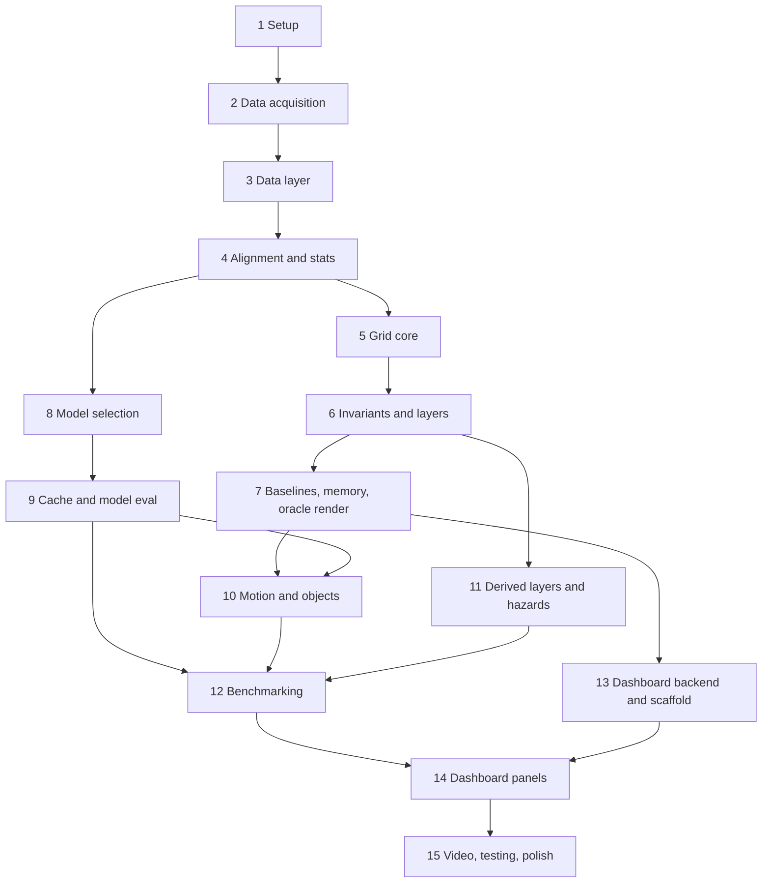

# FoveaMap — 15-Phase Implementation Plan

This is **Section 10 of the FoveaMap README, redistributed into 15 phases**. It is meant to be handed to a human team or an AI agent (e.g. Claude Code) together with the full README. Any "Section X", "Appendix X", and IDs such as `L2`, `R1`, `I4`, `V4` refer to the full README, so keep both files together. The short legend below covers the references used here.

### Reference legend

| Ref | Meaning |
|---|---|
| **R1** | Never hard-code a result number; every figure is generated from configs or benchmark output |
| **R2** | Never weaken a test, threshold or gate to make it pass |
| **R5** | Never claim "real-time" without a measured end-to-end p95 below the sensor period (100 ms) |
| **R6** | Log every deviation from the plan in `docs/DECISIONS.md` (`D-### · date · phase · what · why · impact`) |
| **R10** | After each task, tick its checkbox and append a line to `docs/PROGRESS.md` |
| **R13** | Model inference runs once and is cached; everything downstream runs from the cache without a GPU |
| **L2** | Tune only on sequences **04 and 07**; report only on **08**; never tune on 08 |
| **L14** | "Real-time" is allowed only if measured end-to-end p95 < 100 ms |
| **I1–I10** | Grid invariants (conservation, exact partition, nesting, fine→coarse bit-identity, round trip, determinism, differential test, backend parity, accounting, saturation), defined in README §6.5.5 |
| **V1–V5** | Grid preset validation rules, README §6.5.2 |
| **`[HUMAN]`** | A step the agent cannot do alone (registration, downloads behind a login, GPU access): stop and ask |

---

## 10.0 Workflow rules that apply to every phase

**Phase kickoff protocol**

1. Run `make doctor`; confirm the previous gate is tagged (`phase-<N-1>-complete`).
2. Re-read the phase's tasks, the README sections it references, and the invariants/thresholds involved.
3. Create a branch `phase-<N>` (or work on `main` with one commit per task).

**Per-task loop:** read spec → (for grid/io/derived code) **write the tests first** → implement → run the task's *Verify* command → commit `<type>(<module>): T<phase>.<n> ...` → tick the checkbox → append to `docs/PROGRESS.md`.

**Phase completion protocol:** run the gate commands verbatim; paste their summarised output into `docs/PROGRESS.md`; tag `phase-<N>-complete`; note any deviations in `docs/DECISIONS.md`.

**A task is done when:** code + tests + docstrings + config-driven + logged. No `TODO` is left without a `docs/DECISIONS.md` entry.

**Effort key:** S ≈ ≤ 2 h, M ≈ half-day, L ≈ 1 day (one focused engineer/agent). Estimates guide scheduling only.

**Priority tiers:** **P0** = Minimum Winning Demo, never cut. **P1** = strong differentiators, cut only after P0 is green. **P2** = nice to have, cut first.

---

## 10.1 Phase overview

| # | Phase | Tier | Effort | Depends on | Tag |
|---|---|---|---|---|---|
| 1 | Project Setup & Environment | P0 | ~0.5 d | — | `phase-1-complete` |
| 2 | Data Acquisition & Verification `[HUMAN]` | P0 | ~0.5 d | 1 | `phase-2-complete` |
| 3 | Data Layer (loaders, poses, labels) | P0 | ~1 d | 2 | `phase-3-complete` |
| 4 | Frame Alignment & Data Statistics | P0 | ~0.5 d | 3 | `phase-4-complete` |
| 5 | Grid Core (presets, addressing, rasterisation) | P0 | ~1 d | 4 | `phase-5-complete` |
| 6 | Grid Invariants & Packed Layers | P0 | ~1 d | 5 | `phase-6-complete` |
| 7 | Baselines, Memory Accounting & Oracle Render | P0 (C++ = P2) | ~1 d | 6 | `phase-7-complete` |
| 8 | Segmentation Model Selection & Integration | P0 | ~1 d | 4 | `phase-8-complete` |
| 9 | Prediction Cache & Model Evaluation | P0 | ~1 d | 8 | `phase-9-complete` |
| 10 | Motion & Object Detection | P1 | ~2 d | 7, 9 | `phase-10-complete` |
| 11 | Derived Layers & Synthetic Hazards | P1 | ~2 d | 6 (7 for oracle render) | `phase-11-complete` |
| 12 | Benchmarking | P1 (P0 subset) | ~1.5 d | 9, 10, 11 (subset: 7, 9) | `phase-12-complete` |
| 13 | Dashboard Backend & Frontend Scaffold | P0 | ~1.5 d | 7 (schema frozen) | `phase-13-complete` |
| 14 | Dashboard Panels & Controls | P0 core / P1 extras | ~2 d | 12, 13 | `phase-14-complete` |
| 15 | Offline Video, Testing & Final Polish | P0 | ~1.5 d | 14 | `phase-15-complete` → `v1.0-sih` |

### Dependency graph and parallel tracks

- **Track A (grid):** Phases 5 → 6 → 7.
- **Track B (model):** Phases 8 → 9. Independent of Track A after Phase 4, so it can run in parallel (a second agent or teammate, ideally the one with GPU access).
- **Track C (dashboard):** Phase 13 can start as soon as Phase 7 freezes the message schema (task T7.4), using oracle data.
- Phases 10 and 11 can also run in parallel once their dependencies are met.

**Cut line if time runs out:** cut P2 first (C++ backend, fine-tuning, hazard-injection UI), then P1 (Phases 10, 11 extras), but never the P0 path: 1–9, the P0 subset of 12, 13, the core panels of 14, and 15. The offline video is mandatory in every case.

---

## Phase 1 — Project Setup & Environment  ·  P0  ·  ~0.5 d

**Goal:** a repository skeleton, a reproducible environment, a validated config system, and a working test/lint loop.
**Depends on:** nothing.

- [x] **T1.1 (M)** Create the repository skeleton exactly as in README Section 7 (empty modules with docstrings and `NotImplementedError`), `pyproject.toml`, `.gitignore`, `LICENSE` (MIT), and the `Makefile` (README Appendix D). Seed `docs/DECISIONS.md` with **D-001** (Python package under `src/foveamap/` instead of flat `src/`; `src/main.py` is a shim) and **D-002** (Vite instead of Create-React-App).
- [x] **T1.2 (S)** Create the venv, install `requirements.txt`, run `pip install -e .`, and write `requirements.lock`. *Verify:* `python -c "import foveamap, torch, numpy, scipy, fastapi"`.
- [x] **T1.3 (M)** Write `scripts/doctor.py` (`make doctor`). It prints ✅/⚠️/❌ for: Python ≥ 3.10; `torch.cuda.is_available()` and GPU name; CMake/GCC; Node ≥ 18; ffmpeg; free disk; data layout for the configured sequences; weights present; C++ module importable. GPU and C++ missing are ⚠️ (allowed). Data and weights missing are ⚠️ until Phase 2 and Phase 8 respectively, and ❌ after (`--require-data`, `--require-weights` flags).
- [x] **T1.4 (M)** Implement `foveamap/config.py`: pydantic models for every YAML file in README Section 8, unknown keys rejected, metres→millimetres conversion exact. Write the default YAML files. *Verify:* `pytest tests/test_config.py`.
- [x] **T1.5 (S)** `make test` and `make lint` run (one smoke test is enough for now).

**Gate 1:** `make doctor` shows no ❌ (data and weights are ⚠️ at this stage) · `pytest tests/test_config.py` green · `make test` and `make lint` run.
**Time-box & fallback:** 0.5 day. If CUDA or C++ tooling fails to install, continue without them (both are optional at this point) and log it.

---

## Phase 2 — Data Acquisition & Verification  ·  P0  ·  ~0.5 d  ·  `[HUMAN]`

**Goal:** the SemanticKITTI data is on disk, verified, and one real scan with labels loads.
**Depends on:** Gate 1.

- [ ] **T2.1 (M)** `[HUMAN]` Download per README Section 4.3: SemanticKITTI labels, and KITTI odometry velodyne (sequences 04, 07, 08 are enough, ~10 GB), calibration and ground-truth poses. Extract into `data/dataset/`. The agent must stop and ask the user to complete KITTI registration and the downloads.
- [x] **T2.2 (M)** `scripts/verify_data.py --sequences 04 07 08`: checks the folder layout; that `#labels == #scans`; per-scan `len(label) == N`; `#poses == #scans`; that `calib.txt` parses; and normalises poses by symlinking `poses/<seq>.txt` into `sequences/<seq>/poses.txt` if needed.
- [x] **T2.3 (S)** `python -m foveamap.cli inspect --sequence 08 --idx 0` prints the point count, class histogram (with names) and pose, and writes `results/plots/inspect_08_000000.png` (a simple bird's-eye scatter coloured by raw class).

**Gate 2:** `python scripts/verify_data.py --sequences 04 07 08` passes · `python -m foveamap.cli inspect --sequence 08 --idx 0` runs · `make doctor --require-data` shows no ❌.
**Time-box & fallback:** 3 h of *agent* time. If KITTI registration or the download is blocked, escalate to `[HUMAN]` (a teammate may share the sequence 04/07/08 folders). If only sequence 08 is obtainable, use its first 30 % of frames for tuning and the remaining 70 % for reporting, and log a deviation. Do not switch datasets.

---

## Phase 3 — Data Layer (loaders, poses, labels)  ·  P0  ·  ~1 d

**Goal:** scan, label, pose and calibration loading with the canonical label→super-class mapping.
**Depends on:** Gate 2.

- [x] **T3.1 (S)** `io/kitti.py`: `load_scan_bin`, `load_label` (semantic = `raw & 0xFFFF`, instance = `raw >> 16`). *Verify:* tests for dtype, shape, and label/scan length equality on real files.
- [x] **T3.2 (M)** `io/poses.py`: parse `calib.txt` and `poses.txt`; `relative_transform` exactly per README Section 5.3 (`inv(Tr) @ inv(P_i) @ P_j @ Tr`). *Verify:* identity for `i == j`; `T(i,j) @ T(j,i) = I`; consecutive-scan translation < 3 m and rotation < 5°.
- [x] **T3.3 (M)** `io/labels.py`: `raw_to_super` from the full table (README Appendix A). Cross-check the table against the `semantic-kitti.yaml` (`learning_map`, `learning_map_inv`) from the SemanticKITTI API or the chosen model repo, and log any difference as a deviation. *Verify:* every raw ID in Appendix A is covered; unknown IDs map to `UNKNOWN` with a single warning; moving IDs 252–259 give `DYNAMIC, moving=True`; persons/cyclists are always `DYNAMIC`.
- [x] **T3.4 (S)** `io/sequence.py`: `Sequence` (lazy, indexable, supports `frame_stride`, returns `Scan`).
- [x] **T3.5 (S)** `eval/buckets.py`: `bucket_of_range` (L16: horizontal Euclidean range, buckets 0–10/10–30/30–60/60–100 m) and helpers; first version of `eval/density.py` (points per range bin).

**Gate 3:** `pytest tests/io -q` green · label table cross-check logged.
**Time-box & fallback:** 1 day. If the pose maths misbehaves, do not guess: Phase 4's numeric alignment check is the arbiter.

---

## Phase 4 — Frame Alignment & Data Statistics  ·  P0  ·  ~0.5 d

**Goal:** prove the coordinate-frame alignment across consecutive scans, and produce the data statistics that provide sample sizes for every later far-range metric.
**Depends on:** Gate 3.

- [x] **T4.1 (M)** **Frame-alignment verification.** For 50 random consecutive pairs on sequences 04 and 08, transform scan *i−1* into frame *i* and compute the median nearest-neighbour distance between static-structure points (building/road/vegetation labels, range < 30 m). Save overlay plots to `results/plots/frame_alignment_*.png` and numbers to `results/frame_alignment.json`. **Gate criterion: median < 0.15 m.** If it fails, the transform (most often the `Tr` conjugation order or an inverse) is wrong: fix it, do not raise the threshold.
- [x] **T4.2 (S)** Data statistics table for sequences 04/07/08: points and per-class counts per distance bucket → `results/tables/data_stats.md`.

**Gate 4:** alignment criterion met (`results/frame_alignment.json`) · `results/tables/data_stats.md` exists.
**Time-box & fallback:** 0.5 day. If alignment does not converge after 2 h, cross-check against the SemanticKITTI API's public pose handling, log the finding, and continue.

---

## Phase 5 — Grid Core (presets, addressing, rasterisation)  ·  P0  ·  ~1 d

**Goal:** the nested variable-resolution grid geometry and the NumPy reference rasteriser, all in exact integer arithmetic.
**Depends on:** Gate 4.

- [x] **T5.1 (M)** `grid/presets.py`: `RingSpec`, `GridSpec`, `load_preset`, `validate_preset` (V1–V5), `logical_cells`, `allocated_cells`. *Verify:* a failing-preset test for each rule; **counts computed by the code equal the closed-form formulas** for every preset in README Section 6.5.1.
- [x] **T5.2 (M)** Addressing (README Section 6.5.3): `quantize_mm`, `world_to_cell`, `cell_to_corner_mm`, `cell_to_center_mm`, all integer-only with floor division. *Verify:* invariants **I2** (exact partition) and **I5** (round trip), including the boundary-adversarial point set (`±R_k`, `±R_k∓1 mm`, exact multiples of every cell size, negative coordinates, the origin).
- [x] **T5.3 (L)** `grid/backends/numpy_backend.py` and `accumulators.py`: vectorised `rasterize` producing the integer accumulators of README Section 6.5.4 and the frame counters (`n_raw`, `n_invalid`, `n_in_grid`, `n_out_of_grid`, `n_z_saturated`). *Verify:* **I1** (point conservation) and **I10** (saturation accounting).

**Gate 5:** `pytest tests/grid/test_presets.py tests/grid/test_addressing.py tests/grid/test_conservation.py -q` green (V1–V5, I1, I2, I5, I10; code-computed counts equal closed forms).
**Time-box & fallback:** 1 day. If pure-NumPy min/max reductions are awkward, use sort-by-index plus `np.minimum.reduceat` / `np.maximum.reduceat`; correctness first, speed is handled later.

---

## Phase 6 — Grid Invariants & Packed Layers  ·  P0  ·  ~1 d

**Goal:** prove that fine→coarse aggregation is exact and order-independent, and derive the packed 12-byte per-cell layers.
**Depends on:** Gate 5.

- [ ] **T6.1 (M)** `reduce_block` and the consistency suite: **I4** (fine→coarse == direct accumulation, bit-identical, every field, every ring of `tiny_test` and `tiny_ps_test`), **I6** (permutation invariance and determinism), **I7** (differential test against a deliberately naive dict-based Python implementation, including single-ring/uniform presets). Use `hypothesis` with ≥ 200 examples per property and a fixed seed.
- [ ] **T6.2 (M)** `grid/layers.py`: `finalize` → packed 12-byte layers (README Section 6.6): ground height, top height, overhang clearance, class (`safety` and `majority` rules), moving fraction, count, confidence, flags. *Verify:* hand-built cell fixtures covering every branch (grounded obstacle, overhang, dynamic priority, tie-break, empty cell, `int16` saturation).

**Gate 6:** `pytest tests/grid -q --ignore=tests/grid/test_memory.py --ignore=tests/grid/test_cpp_parity.py` green (I1–I7, I10, layer tests).
**Time-box & fallback:** 1 day. If a hypothesis test is too slow, reduce example *size*, never the example *count* below 100.

---

## Phase 7 — Baselines, Memory Accounting & Oracle Render  ·  P0 (C++ = P2)  ·  ~1 d

**Goal:** uniform baselines through the same engine, four-representation memory accounting, the first rendered map from ground-truth labels, an early cost-of-coarsening prototype, and the frozen dashboard schema.
**Depends on:** Gate 6.

- [ ] **T7.1 (M)** `grid/baselines.py` (uniform presets through the same engine) and `grid/memory.py` (`memory_report`: dense 3D, sparse 3D, uniform 2.5D, FoveaMap; theoretical and measured; README Section 6.9). *Verify:* **I9** (accounting); theoretical numbers match the closed-form values.
- [ ] **T7.2 (M)** Oracle pipeline: `models/oracle.py`, a minimal `pipeline/runner.py` (oracle mode with per-stage timers), and `cli render`, which writes a top-down PNG of the 2.5D map (height-shaded, class-coloured, ring boundaries and cell-size labels overlaid). This is the **first rendered map**.
- [ ] **T7.3 (M)** Preliminary **cost-of-coarsening** prototype (oracle only, 50 scans of sequences 04/07): point back-projection accuracy per distance bucket for `fovea_default`, `ps_literal`, `uniform_5cm`, `uniform_20cm` (README Section 12.4). This establishes the evaluation plumbing early.
- [ ] **T7.4 (S)** Freeze the dashboard message schema (README Section 13.3) into `docs/design/protocol.md`. This unblocks Phase 13.
- [ ] **T7.5 (L, tier P2)** C++/pybind11 backend (`grid/cpp/`, `CMakeLists.txt`, `backends/cpp_backend.py`). **Trigger:** NumPy grid-stage p95 > 15 ms on 100 frames, *or* time remains after P0/P1. *Verify:* **I8** (bit-identical to NumPy) and a timing comparison table.

**Gate 7 (all must pass):**
- `pytest tests/grid -q` passes in full (I1–I7, I9, I10; I8 if C++ built).
- `python -m foveamap.cli render --mode oracle --sequence 08 --frames 0 1 2 --preset fovea_default` writes 3 PNGs with the fovea overlay.
- `python -m foveamap.cli memory --sequence 08 --idx 0` prints the four-representation memory report (theoretical and measured).
- Grid-stage timing over 100 frames is recorded in `results/latency_grid_prelim.json`.
- `docs/design/protocol.md` exists.

**Time-box & fallback:** 1 day. If the NumPy path is too slow, pursue T7.5 or a `numba` fast path that is proven equal by I4/I7-style tests.

---

## Phase 8 — Segmentation Model Selection & Integration  ·  P0  ·  ~1 d  (parallel with Phases 5–7)

**Goal:** a pretrained range-view network chosen on measured evidence and wrapped behind the `SegmentationModel` interface.
**Depends on:** Gate 4 (independent of the grid track).

- [ ] **T8.1 (L)** **Model Selection Gate** (README Section 6.3). For each candidate in order (SalsaNext, CENet, RangeNet++), time-box 90 min: load weights, run one scan, then run every 20th scan of sequence 08 and compute 19-class mIoU. **Sanity floor: mIoU ≥ 40 % and road IoU ≥ 85 %.** Measure inference latency. Record URL, commit, licence, SHA-256, input size/FOV/normalisation, mIoU and latency in `docs/MODEL_CARD.md`. `[HUMAN]` may be needed for weight downloads behind a login. Read the preprocessing parameters from the checkpoint's own repo and config; do not invent them.
- [ ] **T8.2 (M)** `models/rangeview.py`: a wrapper implementing `SegmentationModel`, reusing the reference repo's own preprocessing and (if present) kNN post-processing; vendored under `models/third_party/` or a pinned git submodule with its licence file. Output: `raw_ids` (already mapped through `learning_map_inv`) and `conf` (max-softmax scaled to 0–255).
- [ ] **T8.3 (S)** Parity check: wrapper labels equal the reference repo's own inference output on 3 scans (exact label equality).

**Gate 8:** the chosen model passes the sanity floor · `docs/MODEL_CARD.md` started with the comparison table · wrapper parity test green.
**Time-box & fallback (README Section 6.3):** try the next candidate → train a small range-view network on sequences 00–07 + 09–10 (max 3 h GPU, document the lower accuracy) → ship the degraded **`GeomModel`** (ground vs non-ground only) with every affected panel badged "GEOM (degraded)" and model-dependent metrics marked N/A. Log which fallback was used. A `GeomModel` result must never be presented as deep-learning output.

---

## Phase 9 — Prediction Cache & Model Evaluation  ·  P0  ·  ~1 d  (parallel with Phases 5–7)

**Goal:** predictions cached to disk (R13), and semantic accuracy plus inference latency measured by distance.
**Depends on:** Gate 8.

- [ ] **T9.1 (M)** `scripts/cache_predictions.py`: resumable, writes `data/cache/pred/<model>/<seq>/<idx>.npz` plus a `meta.json` (model name, checkpoint SHA-256, repo commit, input resolution, timestamp, GPU, torch version) for sequences 04, 07 and 08 (all frames of 08). Progress bar and ETA. *Verify:* `#cache files == #scans` for sequence 08. GPU required, but it can be run on any GPU machine and copied in.
- [ ] **T9.2 (S)** `models/cache.py` (`CachedModel`) with a round-trip test; the pipeline's `cached` mode works with **no GPU**.
- [ ] **T9.3 (M)** Accuracy by distance on sequence 08: 19-class mIoU, per-class IoU, and super-class accuracy per distance bucket, each with point counts → `results/accuracy_model.json` and `results/tables/accuracy_by_distance.md`.
- [ ] **T9.4 (S)** Inference latency profile (batch 1, warm-up 50, ≥ 200 frames) → `results/latency_inference.json`, plus the alternatives comparison table (including the optional sparse-conv reference on a small subset) for the "why range-view" justification.
- [ ] **T9.5 (L, tier P2)** Distance-weighted fine-tuning (README Section 6.3, train on 00–07 + 09–10 only); report the per-bucket delta versus the base checkpoint.

**Gate 9:** the cache is complete for sequence 08 · `results/tables/accuracy_by_distance.md` exists with n per bucket · sanity floor met · `docs/MODEL_CARD.md` complete · `python src/main.py --mode cached --sequence 08 --model <name> --dry-run 10` processes 10 frames with no GPU.
**Time-box & fallback:** 1 day; if there is no GPU locally, generate the cache on Colab/Kaggle/a teammate's machine and copy it in.

---

## Phase 10 — Motion & Object Detection  ·  P1  ·  ~2 d

**Goal:** geometric moving-object detection and oriented object boxes with honestly reported accuracy.
**Depends on:** Gates 7 and 9.

- [ ] **T10.1 (M)** `motion/residual.py`: range-image projection (parameters from `configs/model.yaml`), ego-compensated previous scan, windowed residual, per-point vote. *Verify:* synthetic test — a static planar scene gives ~0 votes; a box translated by a known amount gives votes concentrated on the box.
- [ ] **T10.2 (M)** `motion/cluster.py` and `motion/boxes.py`: range-scaled Euclidean clustering and minimum-area oriented rectangle. *Verify:* synthetic clusters with known yaw recovered within `angle_step_deg`; height and size correct.
- [ ] **T10.3 (M)** `motion/pipeline.py` (`estimate_motion`): steps 1–5, 7–8 of README Section 6.4; wire into `PipelineRunner` (model path). In the **oracle path**, motion comes from raw IDs 252–259 and the objects are formed from GT instance IDs.
- [ ] **T10.4 (M, optional)** `motion/tracker.py` temporal hysteresis (step 6) and the `occlusion_rule`.
- [ ] **T10.5 (M)** **Tuning on dev sequences 04 and 07 only (L2):** ablation over `frame_gaps ∈ {1,2,3,5}`, `τ0, τ1`, `vote_frac`; select by point-level moving-class IoU subject to the false-positive rate on stationary vehicles; write `results/tables/motion_ablation.md`; **freeze** `configs/motion.yaml` in a dedicated commit.
- [ ] **T10.6 (M)** `eval/motion_eval.py` on sequence 08: point-level moving IoU; object-level recall/precision (a predicted cluster matches a GT instance if ≥ 50 % of its points belong to it); **false-positive rate on stationary vehicles**; all per distance bucket with counts.
- [ ] **T10.7 (S)** Object recall/precision and classification accuracy by distance.

**Gate 10:** `pytest tests/motion -q` green · `results/motion_metrics.json` and `results/object_metrics.json` written with sample sizes · frozen config commit referenced in `docs/PROGRESS.md` · a short honest strengths/weaknesses summary added to `docs/LIMITATIONS.md`.
**Time-box & fallback:** 2 days. If accuracy is poor, simplify (single gap, no hysteresis), **report the numbers as they are**, and point to the learned-MOS roadmap item. Never tune on sequence 08.

---

## Phase 11 — Derived Layers & Synthetic Hazards  ·  P1  ·  ~2 d

**Goal:** slope, kerb/step, clearance and traversability layers, plus synthetic hazard injection with per-ring detection rates.
**Depends on:** Gate 6 (oracle or model output; Gate 7 for the render checks).

- [ ] **T11.1 (M)** `derived/halo.py`: one-cell halo from adjacent rings (coarse→fine by replication; fine→coarse via exact `reduce_block`). *Verify:* a smooth synthetic ramp crossing ring boundaries yields continuous slope with no seam artefacts.
- [ ] **T11.2 (S)** `derived/slope.py` — central-difference slope, masked where neighbours have no ground.
- [ ] **T11.3 (M)** `derived/step.py` — step/kerb detector (README Section 6.7).
- [ ] **T11.4 (S)** `derived/clearance.py` — overhang clearance and `low_clearance` flag.
- [ ] **T11.5 (S)** `derived/traversability.py` — 3-state map (`TRAVERSABLE`, `NON_TRAVERSABLE`, `UNKNOWN`; unknown is not free).
- [ ] **T11.6 (M)** Synthetic-terrain unit tests: a ramp of known slope is recovered within tolerance at each ring resolution; a step of known height (e.g. 12 cm) sets the kerb flag at rings 1–2, with quantified degradation at coarse rings; an overhang slab sets `low_clearance`; empty cells are `UNKNOWN`.
- [ ] **T11.7 (M)** `derived/hazards.py` (README Section 6.8): pothole/kerb/overhang injection with a seeded RNG and placement rules; injected points carry ground-truth hazard footprints.
- [ ] **T11.8 (M)** `eval/hazard_eval.py`: detection rate per ring, per distance bucket and per hazard size; ≥ 200 injections per bucket; Wilson 95 % CIs → `results/hazard_metrics.json`, `results/plots/hazard_detection_by_ring.png`.
- [ ] **T11.9 (M)** **Zoom-lens data path:** `render_zoom(acc_or_layers, world_box, preset_fine, preset_coarse)` returning the same world window at fine and coarse resolution. Save `results/plots/zoom_kerb_fine_vs_coarse.png` for a real kerb in sequence 08 (a frame with a clear sidewalk/road boundary within 10 m; record the frame index).
- [ ] **T11.10 (S)** Sanity-check thresholds on dev sequences 04/07 by visual inspection; if any default in `configs/derived.yaml` is changed, log a deviation with before/after images.

**Gate 11:** `pytest tests/derived -q` green · the kerb is visibly detected at fine resolution in the saved zoom figure · `results/hazard_metrics.json` exists with n ≥ 200 per bucket and CIs · a rendered traversability map PNG for one frame exists.
**Time-box & fallback:** 2 days. If short of time, drop the hazard UI (Phase 14) but keep the offline hazard evaluation; drop the pothole type before the kerb.

---

## Phase 12 — Benchmarking  ·  P1 (P0 subset: latency, memory, accuracy-by-distance)  ·  ~1.5 d

**Goal:** **one command regenerates every metric, plot and README result table.** No hand-typed numbers (R1).
**Depends on:** Gates 9, 10, 11 (the P0 subset needs only Gates 7 and 9).

- [ ] **T12.1 (M)** `make benchmark` orchestrator: reads `configs/benchmark.yaml`, runs each experiment, and writes one JSON per experiment under `results/` with metadata (git commit, config hash, hardware, library versions, timestamp, frame stride).
- [ ] **T12.2 (S)** **Semantic accuracy** by distance (model vs GT) — reuse T9.3.
- [ ] **T12.3 (M)** **Latency & FPS:** live-mode end-to-end run per README Section 6.10 (≥ 1,000 frames, warm-up 50) with per-stage p50/p95/p99 and the `REAL-TIME: YES/NO` verdict. Requires a GPU; if unavailable, run cached mode and label the report "no-inference latency (GPU unavailable)"; never claim real-time from it (R5, L14).
- [ ] **T12.4 (M)** **Memory:** theoretical and measured for the four representations, mean/p95 over frames, with the log-scale bar figure.
- [ ] **T12.5 (M)** **Cost of coarsening** (oracle labels): the full protocol of README Section 12.4 across `fovea_default`, `ps_literal`, `uniform_5cm`, `uniform_20cm`.
- [ ] **T12.6 (M)** **Sensor-physics justification:** point spacing vs range and cell occupancy vs range (`eval/density.py`) with ring cell sizes overlaid (README Section 12.7) → `results/plots/density_vs_range.png`, `results/plots/occupancy_vs_range.png`.
- [ ] **T12.7 (S)** Motion, object and hazard experiments wired into the orchestrator (from Phases 10–11).
- [ ] **T12.8 (M)** **Memory-vs-accuracy trade-off sweep** over the grid configurations in `configs/benchmark.yaml` (combinations failing V1–V5 are skipped and logged) → Pareto plot with the uniform baselines; the report generates the plain-language conclusion from the numbers, **whichever way it comes out**.
- [ ] **T12.9 (M)** `eval/report.py` / `make report`: regenerates the tables between `<!-- BEGIN:RESULTS -->` … `<!-- END:RESULTS -->` in the README, writes figures to `results/plots/`, and writes `results/SUMMARY.md`.
- [ ] **T12.10 (S)** Reproducibility test: run the benchmark twice on 20 frames; all deterministic metrics (everything except latency) are identical.

**Gate 12:** from a clean checkout with the data and prediction cache present, `make benchmark && make report` completes and produces every artifact listed in README Section 12 · the reproducibility test passes · every number in the README result block is generated (no hand edits).
**Time-box & fallback:** 1.5 days; use `frame_stride: 5` for heavy experiments if needed, and state the stride in every table.

---

## Phase 13 — Dashboard Backend & Frontend Scaffold  ·  P0  ·  ~1.5 d

**Goal:** a working server and a frontend shell that talk to each other over the frozen protocol, on oracle data.
**Depends on:** Gate 7 (schema frozen in T7.4). Can run in parallel with Phases 8–12.

- [ ] **T13.1 (M)** `server/protocol.py` (typed message schema per README Section 13.3) and `server/render.py` (server-side ring textures: height-shaded RGBA per ring, selectable layer, WebP/PNG; ring texture orientation convention `row = N_k − 1 − ix`, `col = N_k − 1 − iy`).
- [ ] **T13.2 (M)** `server/app.py` and `sockets.py`: FastAPI + `python-socketio`; playback loop with `play / pause / step / seek / speed`; modes `oracle | cached | live`.
- [ ] **T13.3 (M)** `src/dashboard` scaffold: React 18 + Vite + TypeScript, Socket.IO client, global state store, dark theme, single-screen grid layout with placeholder panels; receives frames and shows the ring textures.
- [ ] **T13.4 (M)** Python end-to-end test: start the server in oracle mode, connect a `python-socketio` client, receive ≥ 10 frames, and validate every message against the schema; a render test that ring textures have the expected shapes.

**Gate 13:** the server e2e test passes · `npm run typecheck` and `npm run build` succeed · opening the dashboard in oracle mode shows the live-updating ring textures.
**Time-box & fallback:** 1.5 days. If the React stack slips, keep the backend and API working and fall back to the static-report path described in Phase 14.

---

## Phase 14 — Dashboard Panels & Controls  ·  P0 core / P1 extras  ·  ~2 d

**Goal:** every panel and control of the single-screen dashboard populated with real results. Full specification: README Section 13.
**Depends on:** Gates 12 and 13.

**Core panels (P0)**

- [ ] **T14.1 (L)** **Map panel:** composites ring textures on a canvas with pan/zoom; layer selector (class · height · traversability · moving · confidence); ring boundary overlay with cell-size labels; object boxes with class labels; moving objects visually distinguished; +x forward is up.
- [ ] **T14.2 (M)** **Memory meter:** log-scale bars for the four representations; toggle theoretical/measured; shows the computed reduction factor and whether it uses logical or allocated cells.
- [ ] **T14.3 (M)** **Latency panel:** stacked per-stage bar against the 100 ms budget line; **pipeline FPS** and **display FPS** shown separately; `REAL-TIME` badge from the verdict rule (L14).
- [ ] **T14.4 (M)** **Accuracy-vs-distance panel:** curves for fovea vs `uniform_5cm` vs `uniform_20cm` per bucket (from benchmark JSON), with n per bucket on hover.
- [ ] **T14.5 (S)** Playback controls, sequence selector, and a permanent **mode badge**: `ORACLE (ground truth)` / `MODEL: <name>` / `GEOM (degraded)`.

**Differentiators (P1) and extras (P2)**

- [ ] **T14.6 (M)** **Zoom lens:** a draggable lens on the map; the server returns the same window at fine and coarse resolution plus whether the kerb detector fires at each; side-by-side rendering.
- [ ] **T14.7 (L)** **Fovea slider:** ring radii and cell sizes adjustable; the UI only allows presets satisfying V1–V5; the server re-rasterises the current frame and returns updated textures, memory report and per-bucket accuracy; recompute latency shown; debounced 150 ms.
- [ ] **T14.8 (M, tier P2)** **Hazard injection:** buttons for pothole/kerb/overhang at a chosen ring/distance; the server injects, re-runs the pipeline for that frame, and returns "detected by ring *k*" or "missed", with the hazard highlighted on the map.

**Gate 14:** `make demo` brings up backend and frontend · every panel is populated for sequence 08 in `cached` mode · the mode badge is always visible · screenshots saved to `results/screens/`.
**Time-box & fallback:** if the frontend slips, ship the minimal panel set first (map + memory + latency + accuracy curve), then add lens and slider. If the frontend is unrecoverable, generate the same panels with matplotlib into a static HTML report, keep the backend for API demonstration, and log a deviation. The offline video (Phase 15) is mandatory regardless.

---

## Phase 15 — Offline Video, Testing & Final Polish  ·  P0  ·  ~1.5 d

**Goal:** the judging-proof offline demo, documentation, licensing, clean-up, and a fresh clone that runs the quickstart.
**Depends on:** Gate 14. (Start T15.1 as soon as Phase 12 results exist, so the video never depends on the live demo working.)

- [ ] **T15.1 (L)** `viz/video.py` + `make video`: a deterministic headless renderer producing `results/video/foveamap_demo.mp4` (1080p, 30 fps, ≥ 60 s; scripted per the storyboard in README Section 13.6 with captions) from cached results, **independent of the live server, GPU and network**.
- [ ] **T15.2 (M)** Frontend tests: `npm run typecheck` and a `vitest` smoke test; Python `@data` test `tests/e2e/test_pipeline_cached.py` (10 cached frames; per-frame counters satisfy `n_raw = n_invalid + n_in_grid + n_out_of_grid`).
- [ ] **T15.3 (S)** Write `docs/DEMO_SCRIPT.md` (timed storyboard plus likely judge questions and where the evidence lives); do a timed dry run.
- [ ] **T15.4 (M)** Regenerate all results; finalise `docs/LIMITATIONS.md`, `docs/MODEL_CARD.md`; ensure the README result block is current.
- [ ] **T15.5 (M)** Licensing audit: SemanticKITTI/KITTI attribution (CC BY-NC-SA 4.0), model weights and code licences (fill in the model name/author in README Section 18), `THIRD_PARTY_LICENSES.md` for all bundled or vendored code; project code under MIT.
- [ ] **T15.6 (M)** `scripts/fresh_clone_test.sh`: clone into a temp dir, create a new venv, install, run `make doctor` and `make test`, and launch the oracle demo against a small data sample. *Verify:* passes end to end.
- [ ] **T15.7 (S)** Code clean-up: `ruff`, `black`, `mypy` on `io/` and `grid/`; remove dead code; audit `TODO`s.
- [ ] **T15.8 (S)** Final sign-off against README **Appendix B** (Master Definition of Done); tag `v1.0-sih`; assemble the submission bundle (`README.md`, `results/SUMMARY.md`, key plots, `results/video/foveamap_demo.mp4`, `docs/`).

**Gate 15:** `ffprobe results/video/foveamap_demo.mp4` reports duration ≥ 60 s · `scripts/fresh_clone_test.sh` passes · every box in README Appendix B is ticked · tags `phase-15-complete` and `v1.0-sih` created.

---

## 10.2 Progress tracker

| # | Phase | Tier | Status | Gate tag |
|---|---|---|---|---|
| 1 | Project Setup & Environment | P0 | ☑ | `phase-1-complete` |
| 2 | Data Acquisition & Verification | P0 | ◐ code done; gate needs data | `phase-2-complete` |
| 3 | Data Layer | P0 | ◐ code done; gate needs data | `phase-3-complete` |
| 4 | Frame Alignment & Data Statistics | P0 | ◐ code done; gate needs data | `phase-4-complete` |
| 5 | Grid Core | P0 | ☑ | `phase-5-complete` |
| 6 | Grid Invariants & Packed Layers | P0 | ☐ | `phase-6-complete` |
| 7 | Baselines, Memory Accounting & Oracle Render | P0 (C++ P2) | ☐ | `phase-7-complete` |
| 8 | Segmentation Model Selection & Integration | P0 | ☐ | `phase-8-complete` |
| 9 | Prediction Cache & Model Evaluation | P0 | ☐ | `phase-9-complete` |
| 10 | Motion & Object Detection | P1 | ☐ | `phase-10-complete` |
| 11 | Derived Layers & Synthetic Hazards | P1 | ☐ | `phase-11-complete` |
| 12 | Benchmarking | P1 (P0 subset) | ☐ | `phase-12-complete` |
| 13 | Dashboard Backend & Frontend Scaffold | P0 | ☐ | `phase-13-complete` |
| 14 | Dashboard Panels & Controls | P0/P1 | ☐ | `phase-14-complete` |
| 15 | Offline Video, Testing & Final Polish | P0 | ☐ | `phase-15-complete`, `v1.0-sih` |

### Where each old phase went

| Old phase (9-phase plan) | New phase(s) |
|---|---|
| 0 Setup | 1 (setup, env, config), 2 (data acquisition & verification) |
| 1 Data layer | 3 (loaders), 4 (alignment & statistics) |
| 2 Grid engine | 5 (core), 6 (invariants & layers), 7 (baselines, memory, oracle render, C++) |
| 3 Segmentation model | 8 (selection & integration), 9 (cache & evaluation) |
| 4 Motion & objects | 10 |
| 5 Derived layers & hazards | 11 |
| 6 Benchmarking | 12 |
| 7 Dashboard & demo | 13 (backend & scaffold), 14 (panels & controls), 15 (video & tests) |
| 8 Polish | 15 |
